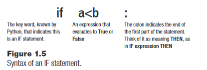
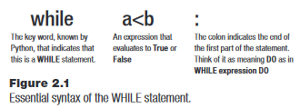
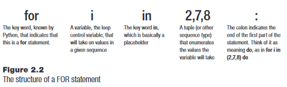
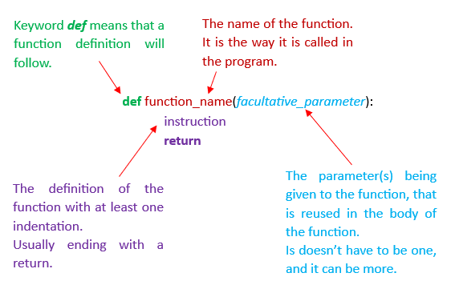
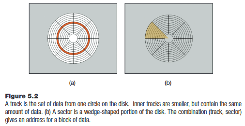
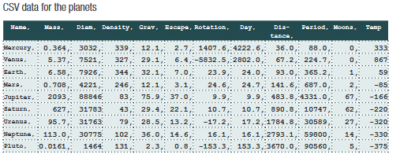
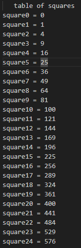
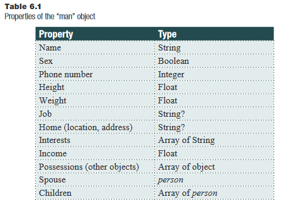

# <center>*Python : an introduction to programming* - second edition (Parker, 2021)

## <center>Chapter 1: Computers and programming

La plupart des ordinateurs sont des *digital computers* : ce sont des ordinateurs qui manipulent des nombres (les programmes sont encodés en caractères humainement compréhensibles). Les *analog computers* sont plus rares et manipulent plutôt des signaux électriques, ou sont mécaniques.

En programmation, on a plutôt besoin d'arithmétique en terme de mathématiques.

### 1.1. Solving a problem using a computer
---

Un programme est un **ensemble d'instructions dans le but de réaliser une tâche à l'aide d'une ordinateur**. Python est un des langages de programmation pouvant être utilisé à cet effet.

Le processus de résolution de problème commence avec une spécification détaillée du problème à résoudre. Il faut comprendre complètement le problème pour que celui-ci puisse être résolu à l'aide d'un ordi. On divise ensuite le problème en une partie qu'on sait résoudre avec nos moyens actuels (méthodes et programmes en notre possession) et en une partie qu'on ne sait pas résoudre.

**Pseudocode** : grandes lignes de la solution, souvent notées par écrit.\
**Script / source cocde / computer program** : le programme en langage de programmation qui résulte du pseudocode.\
**Compileur** : programme qui convertit notre code en code machine (0 et 1) que peut comprendre l'ordinateur.

">>>" en début de ligne = *a prompt*, on se trouve dans l'interpréteur Python.

IDE = "Integrated development environment", c'est un logiciel qui contient un environnement nécessaire au développement (éditeur de texte, débugger...).

Dans un langage de programmation, on trouve :
- des symboles ayant une signification (ex : *+* = *add*, *-* = *substract*)
- des ***reserved words***, des mots-clés qui sont définis par le langage et leur sens ne peut pas être changé par le programmeur (on ne peut pas les utiliser comme noms de variables donc - ex : *if*, *while*, *True*)
- des ***system variables*** qui ont une signification définie par le langage et peuvent être rétuilisées par le programmeur.
- des ***variables*** et des ***fonctions*** qui sont des termes définies par le programmeur pour être utilisées ensuite dans le code.

### 1.2. Guess a number
---
Plusieurs variantes du jeu :
- Deviner de façon précise le nombre : une personne choisit un nombre dans un intervalle spécifique (le *chooser*) et une personne devine (le *guesser*). Si elle devine le nombre, elle a gagné.
- Identique + "plus grand" ou "plus petit".
- Plusieurs guessers avec une seule tentative, le plus proche gagne. En cas d'égalité, on recommence.

#### Solving the *guess a number* problem

<p style= "color: orange"><strong>1ère version</strong> : l'ordinateur choisit un nombre dans un intervalle et l'utilisateur doit le deviner.</p>

1. L'ordinateur choisit un nombre.

        choice = 7

2. L'ordinateur demande au joueur de deviner. Le joueur tape un nombre entier et l'ordinateur récupère la réponse.

        playerchoice = int(input("Please guess a number between 1 and 10 : "))

3. L'ordinateur compare l'input utilisateur avec celui qu'il a choisit ; s'ils sont identiques, le joueur a gagné, sinon l'ordinateur a gagné.

        if choice == playerchoice:
            print("You win !)
        else:
            print("Sorry, you lose.")

Pré-requis Python : imprimer un message dans le prompt, lire un nombre, pouvoir le stocker dans une variable, pouvoir comparer deux nombres et avoir deux issues possibles en fonction du résultat de cette comparaison.

<p style= "color: orange"><strong>2ème version</strong> : identique à la précédente mais on répète le processus si la réponse est mauvaise, jusqu'à ce que ce soit correct.</p>

1. L'ordinateur choisit un nombre aléatoire.

        import random
        choice = random.randint(1, 10)

2. L'ordinateur demande au joueur de deviner et récupère la réponse du joueur.

        playerchoice = int(input("Please guess a number between 1 and 10 : "))

3. L'ordinateur compare l'input utilisateur avec celui qu'il a choisit ; s'ils sont différents, l'ordinateur demande au joueur de deviner à nouveau. **Si l'input utilisateur est identique au choix de l'ordinateur, on passe directement à l'étape 4** *(on ne rentre pas dans le bloc d'instruction de while)*.

        while choice != playerchoice:
            print("Sorry, not correct. Guess again: ")
            playerchoice = int(input())

4. Le joueur a gagné. L'ordinateur print un message de victoire.

        print("You have guessed correctly, congratulations !)

5. Fin du jeu.

Le mécanisme de répétitions est un nouvel aspect par rapport à la version 1 ; la notion de **boucle** est essentielle dans les langages de programmation. On a également ajouté la notion de randomisation avec la fonction built-in *randint()*.

<p style= "color: orange"><strong>3ème version</strong> : évolution de la version 2 avec un débrief pour l'utilisateur si son guess est trop grand ou trop petit.</p>

Reprenons à l'étape 3 où le code change.

3. L'ordinateur compare l'input utilisateur avec celui qu'il a choisit ; **si l'input utilisateur est identique au choix de l'ordinateur, on passe directement à l'étape 4**.

        while choice != playerchoice:

    3.1. Si l'input utilisateur est plus petit que le nombre choisi par l'ordinateur, celui-ci print un message d'information.

            if (playerchoice < choice):
                print("Your guess was too small. Guess again: ")

    3.2. Si au contraire l'input est plus grand, l'ordinateur print un message d'information.

            else:
                print("Your guess was too large. Guess again: ")

    3.3. L'ordinateur récupère le nouvel input du joueur et **retourne au début de l'étape 3**.

            playerchoice = int(input())

4. Le joueur a gagné. L'ordinateur print un message de victoire.

        print("You have guessed correctly, congratulations !)

5. Fin du jeu.

<p style= "color: orange"><strong>4ème version</strong> : on traite les erreurs potentielles qui peuvent survenir.</p>

On utilise *try* pour vérifier que l'input utilisateur est bien un entier, sinon on lève une exception et on redemande à l'utilisateur d'entrer un input.

    import random
    choice = random.randint(1, 10)

    guess = False
    while not guess:
        try:
            playerchoice = int(input("Guess a number between 1 and 10: "))
            guess = True
        except:
            print("Sorry, your guess must be an integer.")
            continue
        if playerchoice < 1 or playerchoice > 10:
            print(f"Your guess was {playerchoice}, which is out of range.")
            guess = False

    if choice == playerchoice:
        print("You win !")
    else:
        print("Sorry, you lose.")

### 1.3. Rock-paper-scissors
---

Deux joueurs choisissent un item de la liste (pierre, feuille, ciseaux) et révèlent simultanément leur choix. Si l'item est identique, on recommence. Sinon, la feuille/le papier bat la pierre, la pierre bat le ciseau et le ciseau bat la feuille/le papier.

#### Solving the *rock-paper-scissors* problem

1. L'ordinateur choisit l'un des trois items et enregistre ce choix dans une variable ***choice***. On peut utiliser une valeur numérique comme 1 = rock, 2 = paper et 3 = scissors. *On peut aussi utiliser une fonction du module random qui choisit parmi une liste d'éléments, pas forcément des entiers.*

        import random
        i = random.randint(1, 3)
            if i == 1:
                choice == "rock"
            elif i == 2:
                choice == "paper"
            else:
                ``` choice == "scissors"

2. Demander au joueur de choisir un item.

        print("Rock-paper-scissors: type in your choice: ")

3. Lire le choix du joueur dans la variable ***player***.

        player = input()

4. Si **player** == **choice** : print "Egalité. Recommençons." \
**Répéter depuis l'étape 1.**

        while choice == player:
            print("Game is a tie. Please try again.")
        # puis code identique à précédemment.

5. Si **player** == 1 (rock) : \
&emsp;Si **choice** == paper, **aller à l'étape 8.**\
&emsp;Sinon, **aller à l'étape 9.**

        if player == "rock":
            if choice == "scissors":
                print("You win.")
            else:
                print("You lose.")

6. Si **player** == 2 (paper) :\
&emsp;Si **choice** == scissors, **aller à l'étape 8.**\
&emsp;Sinon, **aller à l'étape 9.**

        elif player == "paper":
            if choice == "rock":
                print("You win.")
            else:
                print("You lose.")

7. Si **player** == 3 (scissors) :\
&emsp;Si **choice** == rock, **aller à l'étape 8.**\
&emsp;Sinon, **aller à l'étape 9.**

        elif player == "scissors":
            if choice == "paper":
                print("You win.")
            else:
                print("You lose.")

8. Print "L'ordinateur a gagné." et fermer le programme. \
*Message intégré aux boucles ifs.*

9. Print "Vous avez gagné." et fermer le programme. \
*Message intégré aux boucles ifs.*

10. Facultatif : on peut print un dernier message si aucune des conditions précédentes n'est remplie car l'ordinateur ne reconnaît pas le choix du joueur par exemple.

        else:
            print("Error: select one of the followings: rock, paper, scissors")

Pour chaque item, il existe un item qui le bat et un autre contre lequel il perd. Le choix des deux joueurs est checké et, en fonction du résultat, on print un message de victoire ou de défaite. \
On aura donc besoin ici d'une façon de stocker une valeur (= *une variable*), d'une façon d'éxécuter certaines parties du programme en fonction de la valeur (= *if statement*), une façon de lire la valeur du prompt (= *input()*), une façon de print un message à l'écran et enfin une façon d'éxécuter du code à répétition (= *a loop*).

### 1.4. Variables and values-experimenting with the Graphical User Interface

---

Une ***variable*** est un nom que le développeur définit pour représenter une valeur, le plus souvent un nombre ou une chaîne de caractères. Elle représente la place où l'ordinateur stocke cette valeur (l'espace "de nommage", étant lié à l'espace "objet" qu'il représente).

Tout ne peut pas être un nom de variable :
- Une variable ne peut pas commencer par un nombre.
- Une variable ne peut pas commencer par la plupart des caractères non alphabétiques, sauf _ (*underscore* en anglais) dans certaines conditions.
- Une variable peut en revanche contenir des majuscules, des minuscules, des nombres (pas en première position) et des underscores.
- /!\ Python est case-sensitive, donc il distingue les majuscules des minuscules.

Bien qu'il n'y ait pas d'obligation à donner un nom significatif à une variable, c'est préférable pour la compréhension ultérieure et inter-évaluateur.

Une variable peut changer de valeur, mais elle ne peut contenir qu'une valeur à la fois. Elle est du même type que le dernier objet qui lui a été assigné.

<p style="color:green"> Exemple : on définit une variable <strong>pi</strong> associée à la valeur 3.1415926. Le nombre 3.1415926 est une constante, mais c'est aussi une <em>expression</em>. Le symbole <em>=</em> signifie <em>assign to</em>. Donc pi = 3.1415926 est un <em>assignment statement</em> et donne à la variable <strong>pi</strong> une valeur spécifique. <br>
On définit une nouvelle variable appelée <strong>radius</strong>, assignée à 10.0.<br>
On peut manipuler les valeurs via les variables comme ceci : pour calculer la circonférence d'un cercle, on a la formule <em>2 x pi x r</em>. On souhaite assigner la réponse à une nouvelle variable circonférence : <em>circumference = 2</em> * <em>pi</em> * <em>radius</em>. Si on tape <em>circumference</em> dans l'interpréteur ensuite, celui-ci nous renverra 62.832852.

Quand on assigne une variable à une valeur, la variable prend le type de la valeur qu'elle représente (une string, un entier, une liste,...). On ne peut pas utiliser une variable avant de l'avoir assignée à une valeur, cela retournerait un message d'erreur.
<center>

| Not allowed | allowed |
|:---:|:---:|
| *area = side * side <br>side = 12.0* | *side = 12.0 <br>area = side * side* |

</center>

On appelle cela des *statements* en Python. Dans d'autres langages de programmation, les statements sont séparés par des *;* (*semicolon* en anglais), alors qu'en Python ils sont marqués par la fin d'une ligne et les indentations.

Les ***expressions*** : ce sont des opérations numériques vues en arithmétiques (=, +, -, *, /). La priorité opératoire (*precedence rule* en anglais) est respectée. On rappelle que ** en Python marque la **puissance/l'exposant**. Il est prioritaire et est donc réalisé avant toute autre opération.
Evidemment, on peut utiliser des parenthèses pour favoriser une opération (parenthèse > exposant).

<p style="color: green">Exemple : 1 + 2**3 = 1 + 2<sup>3</sup> = 9<br>
&emsp;&emsp;&emsp;&emsp;(1+2)**3 = 3<sup>3</sup> = 27</p>

En Python, on a des opérations un peu particulières, notamment concernant les divisions :
- **Division entière** (*integer division*) représentée par *//*. Le résultat de ce type de division sera arrondi à l'entier inférieur.
<p style="color: green"><em>3//2 = 1</em> ou <em>3//6 = 0</em></p>

- **Division naturelle/décimale** resprésentée par */*. Elle permet de calculer le quotient de la division décimale et donnera donc un nombre flottant/décimal comme résultat.
<p style="color: green"><em>3/2 = 1.5</em> ou <em>3/6 = 0.5</em></p>

- **Modulo** resprésenté par *%*. Calcule le **reste** de la division **entière**.
<p style="color: green"><em>3%2 = 1</em> ou <em>3%6 = 3</em></p>

- **Valeur absolue** (*absolute*) représentée par *abs()*. Elle donne la valeur absolue d'une nombre.
<p style="color: green"><em>abs(-3) = 3</em></p>

### 1.5. Exchanging information with the computer

---

Il y a un échange d'informations entre l'ordinateur et l'utilisateur. Par exemple, l'utilisateur communique la valeur du radius à l'ordinateur, puis l'ordinateur communique la circonférence du cercle à l'utilisateur à partir du radius et de la formule donnés. De prime abord, cet échange se fait via du texte, des caractères tapés à l'aide d'un clavier. Mais cela n'est que la forme définie par le développeur, c'est en réalité des séries de nombre qui sont échangées.

Pour envoyer un message à l'écran, le développeur utilise la commande ***print()*** qui renvoie une chaîne de caractères apparaissant à l'écran. \
On peut également séparés les éléments qu'on souhaite mentionner par des virgules (*comma* en anglais).

<p style="color: green">Exemple : <em>print("The circumference is", 62.831852)</em> ou <em>print("The circumference is", circumference)</em> - on note ici la variable <em>circumference</em>, qui sera remplacée dans le message par sa valeur.

### 1.6. Strings, integers and real numbers

---

On distingue les nombres entiers (*intergers* ou *whole numbers* en anglais) et nombres flottants (*real number* ou *floating-point numbers/float numbers* en anglais). Une variable python peut être d'un type ou de l'autre. \
On peut mélanger des opérations des deux types, mais il vaut mieux éviter ou mettre des parenthèses pour indiquer les priorités.
<p style="color: red">Attention, *var = 6* n'est pas égal à *var = 6.0* !</p>

On peut aussi convertir un type en un autre (en remplissant certaines conditions).
- ***float(n)*** permet de convertir un entier n en un nombre flottant n.0.
<p style="color: green"><em>float(3) = 3.0</em></p>

- ***int(n.x)*** permet de convertir un flottant n.x en un entier n.
<p style="color: green"><em>int(3.5) = 3*</em>

- ***round(n.x)*** permet de convertir un nombre flottant en l'entier le plus proche.
<p style="color: green"><em>round(3.5) = 4</em> ou <em>round(3.3) = 3</em>

### 1.6.1. Example : compute the circumference of any circle

Si on revient sur l'exemple de print de notre circonférence, on ne l'a calculée que sur un radius donné, indiqué par le développeur.
En pratique, ce n'est pas très pertinent si on souhaite faire un programme qui calcule la circonférence de n'importe quel cercle, et il vaudrait mieux demander la valeur à l'utilisateur via un ***input***. \
Attention cependant car l'input retourne une **string** qui ne peut pas être utilisée telle quelle pour faire des opérations. Il faut donc convertir son type en un type opératoire.

    radius = float(input())

*Si ce qu'on souhaite manipuler est un nombre flottant, sinon on peut utiliser **int()**. Il est préférable d'utiliser float() car moins de risque de perte d'information dans ce genre de situation.*

Si la conversion n'a pas été faite, Python renvoie un message d'erreur de type *TypeError*. Les erreurs sont descriptives en Python, et relativement explicites. La ligne où l'erreur est retrouvée est retranscrite également. \
<p style="color: green"><em>TypeError: can't multiply sequence by non-int of type 'float' → cela signifie qu'un élément qui ne peut pas être multiplié (une string, ici en l'occurence la variable radius retournée par l'utilisateur) a été utilisé dans une expression impliquant une multiplication.</em>

### 1.7. **if** statements

---

C'est une phrase conditionnelle commençant par ***if*** suivi d'une **expression logique** (*logical expression*) dont l'issue est soit *True*, soit *False*. Elle s'achève par : (*colon*). S'ensuit une série de code qui ne sera exécutée que si la condition *if* est évaluée *True*.




*True* et *False* sont des *booléens*, un type d'entier qui ne prennent que deux valeurs distinctes (1 / 0, True / False).

La condition *if* peut prendre plusieurs formes :
- *if True* : # **Constant**
- *if flag (True or False value)* : # **Logical variable**
- *if a < b* : # **Relational expression**
- *if a < b and c > d* : # **Logical combination**

<br>

| Relational expressions | |
| :---: | ---|
| < | inférieur |
| > | supérieur |
| <= | inférieur ou égal |
| >= | supérieur ou égal |
| == | équivalent à |
| != | différent de |

<br>

| Logical combinations | |
| :---: | ---|
| and | 2 conditions à remplir pour être True |
| or | 1 condition ou l'autre à remplir pour être True |
| not | équivalent à != |

<br>

Ce qui suit les "*:*" est appelé *consequent* (ou *bloc d'instructions*). Ils prennent une indentation supplémentaire que le *if* et toutes les phrases suivantes prenant la même indentation sont exécutées comme des conséquences du if. Si le *if* est *False*, aucune de ces actions ne sont exécutées. \
*Par convention, en Python, une indentation = 4 espaces. La plupart des autres langages ne lisent ni les sauts de ligne ni les espaces et utilisent des séparateurs (; par exemple) pour distinguer les statements.*

    if a < b:
        a = a + 1
        b = b - 1
    c = a - b

Les deux lignes suivant le *if* ont une indentation de plus que le *if*, ils appartiennent donc au *if*. Des groupes de statements est appelé une *suite*. La dernière ligne avec la variable c a la même indentation que le *if* et sera donc réalisée quoi qu'il arrive à la suite du *if*.

<p style="color: green">Exemple de code <em>Java</em> :</p>

    if (a < b) {
        a = a + 1;
        b = b - 1;
    }
    c = a - b;

L'utilisation des {...} (*braces*) identifie la suite, c'est ce qu'on appellerait un *block* en Java ou C++. *On appelle aussi **bloc d'instruction** la suite de consignes en Python.* L'indentation est ici uniquement utilisée pour simplifier la lecture du code pour un humain.

On retrouve l'utilisation des ; en Python également mais dans un autre but : ils sont utilisés si on veut écrire plus d'un statement sur une même ligne. Mais c'est souvent plus difficile à comprendre rapidement donc on évite. On privilégie toujours la clarté à la compacité.

    if (a < b): a = a + 1; b = b - 1
    c = a - b

Il existe aussi des opérateurs d'assignation un peu spéciaux, comme les opérateurs d'**incrémentation** (+=) / **décrémentation** (-=). <em>*=, /=, **= et %= existent aussi.</em>

<p style="color: green"><em>a = a + 1 → a += 1</em> et <em>b = b - 1 → b += 1</em></p>

L'incrémentation peut aussi s'appliquer à des types non numériques, comme une liste :

    liste = [0, 3, 5]
    liste += ["a", "b"] ; print(liste)

`[0, 3, 5, "a", "b"]` # output

*La liste ne supporte pas la décrémentation en revanche.*

### 1.7.1. else

***Else*** appartient au statement ***if***. Si la condition *if* est *True*, on exécute son bloc d'instruction ; si elle est *False*, on peut aussi exécuter un autre set d'instructions, contenu dans la clause *else*. \
Un *if statement* peut exister sans le *else*, mais l'inverse n'est pas vrai.

    if a < b:
        print("a < b")
    else:
        print("a >= b")

Qui pourrait aussi s'écrre :

    if a < b:
        print("a < b")
    if not a < b:
        print("a >= b")

*else* est :
- Expressif : il correspond à une façon syntaxique correct d'énoncer une alternative dans le langage humain.
- Efficace : il évite d'évaluer deux fois la même expression comme dans la deuxième version du code, et permet ainsi de gagner en vitesse d'exécution.
- Grammaticalement pratique.

### 1.7.2. Nested IFs

Ce sont des *if* dans un *if*. Souvent il existe une alternative non imbriquée, mais c'est plus long à coder et plus fastidieux à lire.

<p style="color: green"> Nested IFs :</p>

    if player == "scissors":
        if choice == "rock":
            print("Computer wins.")
        else:
            print("You win!")

<p style="color: green"> Non-nested IFs :</p>

    if player == "scissors" and choice == "rock":
        print("Computer wins.")
    if player == "scissors" and choice != "rock":
        print("You win!")

*On n'utilise pas ici le else car il existe d'autres alternatives au if qui ne remplissent pas les conditions qu'on souhaiterait dans le else ; il faut donc faire deux ifs distincts.*

### 1.7.3. elif

On peut parfois se retrouver avec trop de répétitions et de nested-IFs. Une alternative à cela est le ***elif*** ; il combine un *else* et un *if*.

<p style="color: green">Without <em>elif</em> :</p>

    if a < b:
        print("a < b")
    else:
        if a > b:
            print("a > b")
        else:
            print("a = b")

<p style="color: green">With <em>elif</em> :</p>

    if a < b:
        print("a < b")
    elif a > b:
        print("a > b")
    else:
        print("a = b")

Cette méthode réduit considérablement le nombre d'indentation et améliore la lisibilité. Cela permet aussi de ne pas lire les lignes suivantes inutilement (comme avec deux ifs) si une condition a déjà été remplie et cela améliore la vitesse d'exécution du programme. \
*Exemple ici, si le premier if est exécuté, l'ordinateur ne lira pas elif ni else car il sait que ce sont des alternatives au premier if.*

### 1.8. Documentation

---

La documentation **externe** est comme un manuel utilisateur. C'est un texte qui explique  ce que fait le programme ; il est plus ou moins long selon le programme. *Il vaut mieux l'écrire en anglais, c'est universel.*

<p style="color: green">Un exemple de documentation pour <em>Guess a number</em> : <em>Guess a number is a simple guessing game. The computer will select a number between 1 and 10 and you are expected to guess what it is. When the program displays 'Please guess a number between 1 and 10: ', you type in your guess followed by the Enter key. Your guess must be an integer in the range 1 to 10. The computer will tell you if you win or lose.</em></p>

La documentation **interne** est destinée aux programmeurs qui ont accès au code source du programme. \
Ce sont typiquement des **commentaires** laissés dans le code. On l'écrit souvent en anglais aussi, dans une syntaxe humaine car c'est un morceau de code qui sera ignorée par l'ordinateur. Un commentaire commence par ***#*** et se termine au prochain saut de ligne.\
On trouve aussi les **docstrings** ***"""..."""***, qui sont des strings, donc peuvent être stockées dans un document séparé pour être utilisée comme description d'une fonction par exemple.

### 1.9. Types are dynamic

---

En Python, le type d'une variable peut changer en fonction de l'objet auquel elle est assignée.

<p style="color: green"><em>x = 10</em> # x est un entier<br>
<em>x = x * 0.1</em> # x est un flottant<br>
<em>x = (x * 10 == 10)</em> # x est un booléen (<em>True</em>)</p>

Si on prend un langage **statique** comme le C++, un entier est un emplacement de 32 bits (4 octets) stocké dans la mémoire, il a donc une "taille" fixe ; donc le plus grand nombre stockable est 2<sup>32</sup> -1.

On peut connaître le type d'une variable en Python par la fonction ***type()***, qui nous retournera : \
`<class 'int/float/str'>` → ce n'est pas une string mais un *type* !\
Si on change l'assignation de la variable ensuite, son type peut changer et la fonction ne retournera pas le même résultat.

---
## <center>Aparté : Number bases

Pour compter, on utilise toujours une **base** et des **"digits"** auquels on multiplie la base.

### Base 10 ou base décimale
---

C'est le système de comptage le plus répandu, probablement car on a 10 doigts.\
Elle se compose d'un symbole pour chaque digit, soit 10 digits de **0 à 9**. \
Pour compter au-delà, il faut changer de rang (unité, dizaine, centaine, etc) et recommencer le comptage de 0 à 9 dans le nouveau rang et les unités reviennent à 0. A chaque fois qu'on augmente le digit d'un rang, on recommence le compte de tous les digits dans les rangs précédents de droite à gauche.
<p style="color: green">Illustration : à 9, on ne peut pas compter plus loin en unité, on ramène donc les unités à 0 et on recommence le compte dans le rang des dizaines : 10. Puis 11, 12,... jusqu'à 19 --> 20. Puis à 219, on remettra à 0 les unités pour augmenter la dizaine : 220. Puis on comptera à nouveau et arriver à 299, on ne pourra plus augmenter ni le rang des unités ni celui des dizaines --> on augmente le rang suivant : 300.

Chaque rang est à une puissance de 10 supérieure au précédent : un rang = rang précédent * 10.
<p style="color: green"><em>100 (une centaine) = 10 * 10 (10 dizaines)* et *10 (une dizaine) = 01 * 10 (dix unités)</em></p>

<p style="color: green">En décomposant en base 10 : <em>216<sub>10</sub> = 200 + 10 + 6 = 2 * 10<sup> 2</sup> + 1 * 10<sup> 1</sup> + 6 * 10<sup> 0</sup></em></p>

### Base 2 ou base binaire
---

C'est la plus importante en informatique car c'est le code pour s'adresser à l'ordinateur (code machine). \
En base 2, les nombres n'ont que 2 digits : **0 et 1**. \
Chacun représente une puissance de 2 en fonction du rang auquel on le trouve. Les rangs décimaux (unités, dizaines, centaines, etc) correspondent ici à des rangs binaires (*binary digit* = *bit*).

Les nombres **pairs** prennent toujours un **0 tout à droite** tandis que les nombres **impairs** prennent systématiquement un **1 tout à droite**.

**Convertir du binaire au décimal :**

On additionne chaque rang en multipliant **son digit avec 2<sup>son rang</sup>**.
<p style="color: green"><em>101 0110<sub>2</sub> = 1 * 2<sup> 6</sup> + 0 * 2<sup> 5</sup> + 1 * 2<sup> 4</sup> + 0 * 2<sup> 3</sup> + 1 * 2<sup> 2</sup> + 1 * 2<sup> 1</sup> + 0 * 2<sup> 0</sup></em><br>
&emsp;&emsp;&emsp;&emsp;&emsp;<em>= 1 * 64 + 1 * 16 + 1 * 4 + 1 * 2</em><br>
<strong><em>101 0110<sub>2</sub> = 86<sub>10</sub></em></strong></p>

<center>

| Valeur décimale | Conversion | Valeur binaire |
|:---:|:---:| :---: |
| 0 | 0 * 2<sup>0 | 0
| 1 | 1 * 2<sup>0 | 1
| 2 | 1 * 2<sup>1</sup> + 0 * 2<sup>0 | 10
| 3 | 1 * 2<sup>1</sup> + 1 * 2<sup>0 | 11
| 4 | 1 * 2<sup>2</sup> + 0 * 2<sup>1</sup> + 0 * 2<sup>0 | 100
| 5 | 1 * 2<sup>2</sup> + 0 * 2<sup>1</sup> + 1 * 2<sup>0 | 101
| 6 | 1 * 2<sup>2</sup> + 1 * 2<sup>1</sup> + 0 * 2<sup>0 | 110
| 7 | 1 * 2<sup>2</sup> + 1 * 2<sup>1</sup> + 1 * 2<sup>0 | 111
| 8 | 1 * 2<sup>3</sup> + 0 * 2<sup>2</sup> + 0 * 2<sup>1</sup> + 0 * 2<sup>0 | 1000
| 9 | 1 * 2<sup>3</sup> + 0 * 2<sup>2</sup> + 0 * 2<sup>1</sup> + 1 * 2<sup>0 | 1001
| 10 | 1 * 2<sup>3</sup> + 0 * 2<sup>2</sup> + 1 * 2<sup>1</sup> + 0 * 2<sup>0 | 1010
| 11 | 1 * 2<sup>3</sup> + 0 * 2<sup>2</sup> + 1 * 2<sup>1</sup> + 1 * 2<sup>0 | 1011
| 12 | 1 * 2<sup>3</sup> + 1 * 2<sup>2</sup> + 0 * 2<sup>1</sup> + 0 * 2<sup>0 | 1100
| 13 | 1 * 2<sup>3</sup> + 1 * 2<sup>2</sup> + 0 * 2<sup>1</sup> + 1 * 2<sup>0 | 1101
| 14 | 1 * 2<sup>3</sup> + 1 * 2<sup>2</sup> + 1 * 2<sup>1</sup> + 0 * 2<sup>0 | 1110
| 15 | 1 * 2<sup>3</sup> + 1 * 2<sup>2</sup> + 1 * 2<sup>1</sup> + 1 * 2<sup>0 | 1111
</center>

Donc 15<sub>10</sub> = 1111<sub>2</sub> \
*On peut aussi écrire 15<sub>dec</sub> = 1111<sub>bin</sub> ou 15 = **0b**1111*

***Notons aussi qu'on peut écrire les nombres binaires de façon lisible en les regroupant 4bits par 4 bits.***

**Convertir du décimal au binaire :**

- Méthode 1 : **les puissances de 2** \
Il faut décomposer le nombre décimal en multiple de 2.
    <p style="color: green"><em>26<sub>10</sub> = 16 + 8 + 2<br>
    &emsp;&emsp;= 1 * 16 + 1 * 8 + 1 * 2<br>
    &emsp;&emsp;= <strong>1</strong> * 2<sup> 4</sup> + <strong>1</strong> * 2<sup> 3</sup> + 0 * 2<sup> 2</sup> + <strong>1</strong> * 2<sup> 1</sup> + 0 * 2<sup> 0</sup><br>
    <strong>26<sub>10</sub>= 1 1010<sub>2</sub></strong></em></p>

<center>

| Puissance de 2 | Valeur décimale |
| :---: | :---: |
| 2<sup>0 | 1 |
| 2<sup>1 | 2 |
| 2<sup>2 | 4 |
| 2<sup>3 | 8 |
| 2<sup>4 | 16 |
| 2<sup>5 | 32 |
| 2<sup>6 | 64 |
| 2<sup>7 | 128 |
| 2<sup>8 | 256 |
| 2<sup>9 | 512 |
| 2<sup>10 | 1024 |
| 2<sup>11 | 2048 |
| 2<sup>12 | 4096 |
</center>
<br>

- Méthode 2 : **divisions euclidiennes par 2** \
C'est la méthode la plus simple pour les grands nombres, elle est facile à uiliser en programmation car on peut en faire un algorithme.
    <p style="color: green"><em>Prenons le nombre décimal 164.</em></p>

1. On divise par 2 notre nombre décimal (division **entière**) et on récupère le **reste** à l'aide du **modulo**.
    <p style="color: green"><em>164 // 2 = 82 ; 164 % 2 = <strong>0</strong></em></p>

2. On divise par 2 le quotient obtenu et on note le reste de la division.
    <p style="color: green"><em>82 // 2 = 41 ; 82 % 2 = <strong>0</strong></em></p>

3. On réitère jusqu'à obtenir un **quotient nul**.
    <p style="color: green"><em>41 // 2 = 20 ; 164 % 2 = <strong>1</strong><br>
    20 // 2 = 10 ; 20 % 2 = <strong>0</strong><br>
    10 // 2 = 5 ; 10 % 2 = <strong>0</strong><br>
    5 // 2 = 2 ; 5 % 2 = <strong>1</strong><br>
    2 // 2 = 1 ; 2 % 2 = <strong>0</strong><br>
    1 // 2 = 0 ; 1 % 2 = <strong>1</strong></em></p>
    <em>Ici on peut aussi simplement remarquer si le quotient est pair ou impair et on connaîtra son reste, qu'on a juste à noter.</em>

4. On lit le résultat obtenu à partir des restes, **de bas en haut**, soit du dernier obtenu jusqu'au premier. Ceci nous donne l'équivalent binaire de notre nombre décimal.
    <p style="color: green"><em>164<sub>10</sub> = 1010 0100<sub>2</sub></em></p>

### Base 16 ou base hexadécimale
---
La base 16 comporte donc 16 digits : **0 à 9 puis A à F**. \
Cette base est intéressante car c'est un multiple de la base 2 mais elle permet d'exprimer des nombres binaires avec moins de caractères. \
On utilise la base hex pour représenter les couleurs en Python, ainsi que sur beaucoup de pages Web.
<p style="color: green"><em>Web page : 0xFF0000 = rouge.</em></p>

<center>

| Hexadécimal | Décimal |
| :---: | :---: |
| A | 10 |
| B | 11 |
| C | 12 |
| D | 13 |
| E | 14 |
| F | 15 |
</center>

Le principe reste le même : on augmente les digits pour chaque rang jusqu'à F puis on recommence à 1 au rang suivant et 0 à tous les rangs précédents. \
*Notez que E + 1 = F (14 + 1 = 15 en base décimale), mais que F + 1 = 10 (toujours en hexadécimal).*

**Conversion du décimal à l'hexadécimal :**

On décompose en puissance de 16.

<center>

| Puissance de 16 | Valeur décimale |
| :---: | :---: |
| 16<sup>0 | 1 |
| 16<sup>1 | 16 |
| 16<sup>2 | 256 |
| 16<sup>3 | 4096 |
| 16<sup>4 | 65536 |
</center>

On commence par chercher la plus grande puissance de 16 du nombre.
<p style="color: green"><em>1680<sub>10</sub><br>
1680 // 256 = <strong>6</strong> ; 1680 % 256 = 144<br>
144 // 16 = <strong>9</strong> ; 144 % 16 = 0<br>
Donc 1680<sub>10</sub> = 6 * 256 + 9 * 16 + 0 * 1<br>
&emsp;&emsp;&emsp;&emsp;&emsp;&emsp;= 6 * 16<sup> 2</sup> + 9 * 16<sup> 1</sup> + 0 * 16<sup> 0</sup><br>
&emsp;&emsp; <strong>1680<sub>10</sub> = 690<sub>16</sub></strong></em></p>

*On peut aussi écrire 1680<sub>dec</sub> = 690<sub>hex</sub> ou 1680 = **0x**690.*

**Conversion de l'hexadécimal au décimal :**

Chaque rang est une puissance de 16. \
On multiplie chaque rang par une puissance de 16 croissante.
<p style="color: green"><em>4F2C<sub>16</sub> = 4 15 2 12<br>
&emsp;&emsp;&emsp;= 4 * 16<sup> 3</sup> + 15 * 16<sup> 2</sup> + 2 * 16<sup> 1</sup> + 12 * 16<sup> 0</sup><br>
&emsp;&emsp;&emsp;= 4 * 4096 + 15 * 256 + 2 * 16 + 12 * 1<br>
<strong>(4F2C)<sub>16</sub> = (20 268)<sub>10</sub></strong></em></p>

**Conversion du binaire à l'hexadécimal :**

**2<sup>4</sup> = 16<sup>1</sup>** \
Cela signifie que 4 rangs binaires correspondent à un rang en hexadécimal.
Et en effet, 4 rangs binaires permettent de monter jusqu'à 15 (*1111*), de même qu'un rang hexadécimal (*F*).
On décompose donc, quand c'est possible, 4 rangs par 4 rangs.

<center>

| 101 | 0011 | 1011 |
|:---:|:---:| :---: |
| 0 * 2<sup>3</sup> + **1** * 2<sup>2</sup> + 0 * 2<sup>1</sup> + **1** * 2<sup>0 | 0 * 2<sup>3</sup> + 0 * 2<sup>2</sup> + **1** * 2<sup>1</sup> + **1** * 2<sup>0 | **1** * 2<sup>3</sup> + 0 * 2<sup>2</sup> + **1** * 2<sup>1</sup> + **1** * 2<sup>0 |
| 5 | 3 | 11 = B |
</center>

*Donc (101 0011 1011)<sub>2</sub> = (53B)<sub>16</sub> .*

**Conversion de l'héxadécimal en binaire :**

On passe d'abord par une conversion hex --> dec rang par rang, puis dec --> bin.

<p style="color: green"><em>BE57<sub>16</sub> : B<sub>16</sub> = 11<sub>10</sub> , E<sub>16</sub> = 14<sub>10</sub> , 5<sub>16</sub> = 5<sub>10</sub> , 7<sub>16</sub> = 7<sub>10</sub><br>
11<sub>10</sub> = 1 * 8 + 1 * 2 + 1 * 1 = 1011<sub>2</sub><br>
14<sub>10</sub> = 1 * 8 + 1 * 4 + 1 * 2 = 1110<sub>2</sub><br>
5<sub>10</sub> = 1 * 4 + 1 * 1 = 0101<sub>2</sub><br>
7<sub>10</sub> = 1 * 4 + 1 * 2 + 1 * 1 = 0111<sub>2</sub><br>
Donc <strong>(BE57)<sub>16</sub> = (1011 1110 0101 0111)<sub>2</sub></strong></em></p>

### Base 8 ou base octale
---

Elle se compose de 8 digits : **de 0 à 7**. \
On peut l'exprimer en n<sub>8</sub> ou *0on*.

<center>

| Puissance de 8 | Valeur décimale |
| :---: | :---: |
| 8<sup>0 | 1 |
| 8<sup>1 | 8 |
| 8<sup>2 | 64 |
| 8<sup>3 | 512 |
| 8<sup>4 | 4096 |
</center>

<center><p style="color: red"><strong>Attention !! 1 octal = un rang de la base 8 =/= 1 octet (*byte* en anglais)= 8 bits.</strong></p></center>

---

### Fonctions built-in conversion python
---
***int()*** permet de convertir d'autres types en **entiers décimaux**.

    int("0b10", base= 2)
`2`

    int("0x10", base= 16)
`16`

    int("0o10", base= 8)
`8`

*On peut ne pas mentioner "0b/x/o" avant le chiffre si on mentionne la base. On est pas obligé d'écrire "base =" ; à ce moment-là, on ne met pas de "" autour du nombre, mais on précise 0b/x/o.*

    int("10", base= 8)
`8`

    int(0o10)
`8`

***bin()*** permet de convertir un entier en son équivalent en base 2. Le type de l'output est une string.

    bin(2)
`'0b10'`

---

## <center>Chapter 2: Repetition

Une des raisons en faveur de l'utilisation d'un ordinateur est qu'il est capable de réaliser des tâches fastidieuses, répétitives à une grande vitesse. C'est ce qu'on appelle des ***boucles*** (*loops* en anglais).

### 2.1. The *while* statement

---

C'est une instruction de **répétition tant que** l'affirmation est *True*. Le bloc d'instruction suivant la ligne du while (indenté bien sûr) est réalisé à chaque loop tant que la condition évoquée par le while est *True*. Si la condition est *False*, on n'exécute pas le bloc d'instruction qui suit.

<center><figure>
    
</figure></center>


A chaque tour de boucle, on évalue le statement du while. Pour sortir d'une boucle, il faut donc qu'au sein de la boucle il y ait une instruction qui modifie l'état du statement, sinon c'est une boucle infinie.

*While True* est un exemple de boucle infinie de laquelle on ne peut sortir qu'avec un *return*.

<p style="color: green">Exemple de boucle finie :</p>

    a = 0
    while a < 10:
        a += 1``` # identique : a = a + 1
    print(a)

La boucle while fera 10 tours avant que la condition *a < 10* ne soit *False*. Le bloc d'instruction réalise une incrémentation de 1 sur *a*, ainsi *a* change de valeur à chaque tour et la condition prend fin à un moment. \
Une fois la boucle terminée, l'instruction suivante est réalisée et l'ordinateur print la valeur de *a*, soit 10 à ce stade du programme.

<p style="color: green">Exemple de boucle infinie :</p>

    a = 0
    b = 1
    while b < 10:
        a += 1
    print(a)

Dans ce code, on exécutera jamais l'instruction *print()* car le while est toujours *True* ; en effet, on entre dans la boucle car b = 1 <10 mais aucune instruction dans le bloc ne modifie la condition initiale donc il n'y aura jamais de changement. \
Du point de vue utilisateur, il ne passera rien. Le programme fonctionne mais ne s'arrête jamais. *Pour forcer d'un programme, faire ctrl + C dans le terminal d'éxécution.*

<p style="color: green">Exemple de boucle non réalisée :</p>

    a = 100
    while a < 10:
        a += 1
    print(a)

La condition n'est pas remplie donc on exécute pas le bloc d'instruction suivant. Le *print* renverra 100.

### 2.2 Introduction to module and functions with random numbers
---

Le tirage de nombre aléatoire est utile dans les jeux. \
Le principe de la **randomisation** est de réaliser un tirage aléatoire et une répartition aléatoire de façon à avoir le moins de biais possible.

La probabilité d'un évènement survenu aléatoirement n'est pas lié à la probabilité des évènements précédents ; mais tout dépend comment on pose la question car la probabilité qu'un évènement survienne n'est pas la même que celle que cet évènement se produise deux fois de suite.
<p style= "color: green"><em>Par exemple, si je sélectionne des boules triés de 1 à 10, la probabilité que je tire la boule 5 est de 1/10, soit 0.1. Si je remets la boule 5 et que je resélectionne une boule ensuite, la probabilité que je tire à nouveau le 5 est encore de 1/10.<br>
En revanche, si je me demande quelle est la probabilité que je tire deux fois de suite le 5, alors la probabilité sera de 1/10 * 1/10, soit 1/100 = 0.01.</em></p>

Une **fonction built-in** est comme une fonction mathématiques et correspond à est codée dans le code-source du langage, elle est donc connue par celui-ci.

<p style= "color: green">Exemples de fonction built in : <em>print()</em>, <em>int().</em></p>

Certaines fonctions sont aussi contenues dans des **modules**, comme *sine* ou *square root* contenues dans le module ***math***.

    import math # le module math est importé dans le programme et ses fonctions peuvent être utilisées.

L'instruction ***import*** doit se trouver au début du programme (après le shebang s'il y en a).

Pour appeler une fonction, il faut ensuite appeler le nom du module suivi d'un *.* (*period* en anglais) et du nom de la fonction.

    print(math.sqrt(64))``` # sqrt(x) = un appel de fonction
`8`

---
#### Quelques exemples de fonctions *random*

Il existe un module ***random*** contenant plusieurs modules.

**random()** \
La fonction ***random()*** produit un nombre aléatoire compris entre 0.0 et 1.0.

    import random
    print(random.random())
`0.07229650795715237`

Pour augmenter l'amplitude de random, il suffit de le multiplier par un certain nombre, par exemple pour aller de 0 à 100 :

    print(random.random()*100)

**randint()**
La fonction ***randint()*** accepte deux paramètres (deux nombres). Le premier correspond à la borne inférieure (inclue) et la deuxième est la borne supérieure (inclue) des nombres à produire.

<p style= "color: green">Exemple appliqué au lancer de pièce : pile ou face</p>

    if random.randint(1, 2) == 1:
        print("Heads")
    else:
        print("Tails")


### 2.3. Counting loops : for loops
---

Une boucle ***for*** réalise un nombre d'itérations (tours de boucle) défini.

    for i in (1, 2, 3, 4, 5):
        print(i)
*On printera ici tour à tour 1 puis 2,... jusqu'à 5.*

<center><figure>
    
</figure></center>

*le tuple n'a pas forcément à être entre parenthèses.*

La collection contenue dans les parenthèses est appelée un ***tuple*** (c'est un type d'objet, ou plutôt une nouvelle classe de types). C'est un ensemble d'objets pouvant contenir n'importe quel type d'objets dans n'importe quel ordre : \
*(3, 6, 9, 12)* \
*(2.1, 3.5, 0, 12)* \
*("green", "yellow", "red")* \
*("red", 3, 4.5, 2, "blue", i) où i est une variable avec une valeur assignée précédemment*

La boucle *for* attribue à chaque tour de boucle la valeur de gauche à droite à la variable i. Une fois que tous les objets du tuple sont passés dans la boucle, on sort de la boucle et la suite du code est exécutée. *On a donc autant de tours de boucle qu'il y a d'éléments dans le tuple.*

Pour les boucles longues, on peut utiliser la fonction built-in ***range()***, qui retourne un tuple contenant tous les entiers (positifs ou négatifs) entre les deux paramètres donnés, borne supérieure exclue. Si un seul argument est passé à la fonction, la borne inférieure sera 0 par défaut.

    for i in range(1, 5):
        print(i)
*Cette boucle réalise 4 tours de boucle et print à chaque fois le numéro du tour auquel elle se trouve.*

<center><p style= "color: red">Attention, le nombre de la borne inférieure doit impérativement être inférieur à celui de la borne supérieure.</p></center>

<p style= "color: green">Exemple équivalent au for en Java :</p>

    for (i = 0; i < 5; i = i + 1)

*L'incrémentation est explicite en Java ou en C++.*

### 2.3.1. Prime or non prime

C'est un jeu qui nécessite une boucle for. \
Un nombre premier est un nombre entier divisible uniquement par 1 et par lui-même.
<p style= "color: green"><em>2, 3, 5, 11 ou encore 17 sont des nombres premiers.</em></p>

Le jeu consiste à faire deviner au joueur si un nombre est entier ou non. Le code simplifié est le suivant : \
1.&emsp;Tant que le jeu n'est pas terminé (boucle while/for suivant l'objectif), suivre les étapes suivantes.

2.&emsp;Sélectionner un nombre entier aléatoire k.

3.&emsp;Demander au joueur si k est un nombre premier et récupérer sa réponse.

4.1.&emsp;Si la réponse du joueur est correcte, print un message de victoire. *Cette condition implique que l'ordinateur ait préalablement déterminé si le nombre est un entier.*

4.2.&emsp;Si la réponse du joueur est incorrecte, print un message de défaite.

Si un nombre k possède un diviseur n, cela signifie que le reste de la division de k par n est nulle ; en langage de programmation cela s'écrit :

    k % n == 0
*Si n != 1 et n!= k, alors k n'est pas un nombre premier, car il est divisible par autre chose que 1 et lui-même.*

Un exemple de code pour savoir si k est entier est :

    is_prime = "yes"
    for n in range(2, k):
        if k % n == 0:
            is_prime = "no"
*Ici, on divise le nombre par tous les entiers compris entre 2 et lui-même (exclu). Si un autre nombre le divise sans reste, alors le nombre n'est pas premier : on entre dans le bloc d'instruction de if et is_prime est "no".*

**Améliorations diverses du programme**

- On peut améliorer ce script en cherchant seulement entre 2 et **k/2** car si un nombre supérieur à sa moitié le divise, alors un nombre inférieur le peut aussi et nous l'aurons déjà trouvé dans la boucle :

        for n in range(2, k/2):
On peut encore l'améliorer en cherchant seulement jusqu'à la **racine carrée de notre nombre + 1** :

        for n in range(2, k** 0.5 + 1):
        # exposant 0.5 == exposant 1/2, soit l'inverse du carré, la racine carrée


- On peut aussi si on le souhaite ajouter un décompte du nombre de bonnes réponses et mettre fin aux essais au bout de 10 :

        correct = 0
        for number_guess in range (0, 10):
    *On écrit le programme à la suite et on fait += 1 à correct à chaque bonne réponse.*
    Et à la fin du programme :

        print(f"You gave {correct} answers out of 10.")
    *On pouvait aussi écrire une boucle while qui ferme le programme une fois qu'il y a une erreur.*

### 2.3.1.1. Exiting from a loop

Pour éviter une perte de temps et de ressources, il faut dire à la boucle *for* de s'arrêter dès qu'elle a trouvé que le nombre n'était pas premier. Pour sortir d'une boucle, on utilise l'instruction ***break***.

    is_prime = "yes"
    for n in range(2, k**0.5 + 1):
        if k % n == 0:
            is_prime = "no"
            break

Ici, le programme s'arrête soit après avoir trouvé que le nombre n'était pas premier et être rentré dans la boucle *if* contenant le *break*, soit après avoir réalisé tous les tours de boucle sans entrer dans *if* (le nombre est donc premier).

Une variation de *break* est ***continue***. Cela permet de passer à l'itération suivante sans lire la suite du bloc d'instruction.

    for n in ("bob", 1, 2, 3, "cha"):
        if not isinstance(n, int):
            continue
        print(n**2)
`1` \
`4` \
`9` \
*Ici on crée une boucle qui vérifie si n est un entier ; s'il ne l'est pas, on entre dans le bloc d'instruction du if et on passe à l'itération suivante. S'il l'est, on entre pas dans le if et on réalise l'instruction suivante : print()*

*continue* et *break* ont la même fonction dans les boucles ***while*** et ***loop***.

Modifier la variable en cours d'itération ne change pas le nombre d'itérations réalisées.

    for i in range(0, 3):
        print("Before", i)
        i += 1000
        print("After", i)
`Before 0` \
`After 1000` \
`Before 1` \
`After 1001` \
`Before 2` \
`After 1002`

Ce qui se produit en python est que **la range est traitée comme un ensemble d'éléments donnés** au même titre qu'un tuple d'objets. Ainsi, à chaque itération la variable i de l'exemple se voit assignée le nombre suivant dans la range. Donc en fin de première boucle, i = 1000 et en sortant de la ligne for, i = 1. \
Ce fonctionnement de *for* est différent de celui de la boucle *while*, qui teste à la chaque tour si la condition a changé.

### 2.3.1.2. else

On dit qu'une boucle qui se termine "naturellement" (après toutes les itérations avec *for* ou après que la condition soit passée *False* avec *while*) "have *fallen through*".

On peut ajouter un *else* aux boucles *while* et *for* si les boucles se sont réalisées dans leur intégralité (si elles ont *fallen through*), sans *break*.

<p style= "color: green">Exemple avec le programme <em>isprime game</em></p>

    # for itère sur des entiers donc on doit convertir (k**0.5) en entier car c'est potentiellement un nombre flottant
    for n in range(1, int((k** 0.5) + 1 )):
        if k % n == 0:
            isprime = "no"
            break
    else:
        isprime = "yes"

*Bon, ce n'est pas très utile en soi on peut parfaitement arriver à ce résultat d'autres manières. Je ne présente même pas l'exemple avec le while.*

### 2.4. Loops that are nested
---

On peut évidemment avoir des imbrications des les boucles : des *if* dans des *while* / *for*, des *for* dans des *while* et inversement.

<p style= "color: green">Par exemple, deux boucles for imbriquées :</p>

    for i in range(0,10):
        for j in range (0,10):
        print(i,j)
`0, 0` \
`0, 1` \
`0, 2` \
`0, 3` \
`0, 4` \
`0, 5` \
`0, 6` \
`0, 7` \
`0, 8` \
`0, 9` \
`1, 0` \
`1, 1` \
`1, 2` \
...

*Ici, on a 10 itérations pour la première boucle, et 10 itérations pour la deuxième. Mais la deuxième se réalise au sein de la première, donc pour chaque itération de i, on a 10 itérations de j, soit 10 * 10 = 100 itérations ici.*

<p style= "color: green">Si on veut compter le nombre de diviseur d'un nombre

<p style= "color: green">Si on veut savoir quel est l'entier de 0 à 1000 qui a le plus de diviseurs :</p>

    maxdiv = 1          # the number that has the greatest number of divisors
    maxdivcount = 0         # the number of divisors that maxdiv has
    for k in range (1, 1001):           # boucle qui attribue à k les entiers de 1 à 1000
        count = 0               # décompte du nombre de diviseurs pour k
        for n in range(1, k/2):         # cherche des diviseurs entiers pour k
            if k % n == 0:
                count += 1           # on compte chaque diviseur de k entre 1 et k/2
            count += 1             # on ajoute 1 pour prendre en compte le fait que k est divisible par k
        if count > maxdivcount:       # on compare le compte actuel des diviseurs de k avec le précédent max
            maxdivcount = count    # si le count actuel > max enregistré, on assigne au max le count de k
            maxdiv = k      # on assigne au maxdiv le k actuel
    print(f"The most divisors is {maxdiv} with {maxdivcount}.")
`The most divisors is 840 with 31.`

### 2.5. Draw a histogram
---

Un histogramme est un type de graphique où des valeurs numériques discrètes sont représentées par des rectangles. Il est le plus souvent utilisé pour représenté la fréquence d'un évènement pour une ou plusieurs variables discrètes. Pour en réaliser un, il faut avoir une idée du nombre de catégories et des valeurs numériques de chacune de ces catégories. On met à l'écehelle les nombres pour qu'ils rentrent dans une aire précise et on dessine les rectangles de taille proportionnelle à la valeur qu'ils représentent.

<center><figure>
    
</figure></center>

<br>

Prenons l'exemple d'une entreprise qui voudrait réaliser un histogramme des bénéfices qu'elle a fait pour chaque trimestre de l'année 2016. On stocke les valeurs numériques dans les variables Q1, Q2, Q3, Q4, dont la valeur est comprise dans la range(0, 1000000).

<p style= "color : green">Q1: #################### 20</p>

On a ici de gauche à droite : le **label**, la **bar** et la **data value**. \
Le label apparaît au début de chaque ligne. \
La data value n'est pas nécessaire, mais donne une information utile sur la valeur numérique représentée pour une personne qui lirait le graph. \
Ensuite, la barre est représentée horizontalement ici. Chaque *#* représente une amplitude de valeur, une échelle.

Il faut ensuite définir l'échelle de la barre : si 50 caractères rentrent dans une ligne et que le nombre à représenter est 1M, alors un # = 1 000 000/50, soit 20 000 unités. Ici l'unité est le dollar ($) puisqu'on représente un bénéfice. \
Donc chaque # représente un lot de 20 000$.

Naturellement, un *print()* ajoute un saut de ligne \n à la fin de la string qu'il imprime. Si on utilise l'argument *end = ''*, on modifie le dernier caractère imprimé. Par exemple :

    print(i, end= '!')
*Ici au lieu de print la variable i puis de sauter une ligne pour afficher le prompt, on imprimera i! et le prompteur collé.*

On peut donc utiliser ça pour faire une barre :

    print("#", end = '')
    print("#", end = '')
    print("#", end = '')

`###` \
*Pas de saut de ligne entre chaque.*

==

    for i in range(0,3):
        print("#", end = '')

`###`

Le premier trimestre pourrait être représenté ainsi :

    print("Q1: ", end = '')
    for k in range(0, int(Q1 / 20000)):
        print("#", end = '')
    print("     ", Q1)

`Q1: #########   190 000`

A répéter pour chaque quarter (on peut écrire une fonction) et on ajoute un titre.

### 2.6. Loops in general
---

En assembleur, les boucles étaient des *branches* ou des *goto* dont la condition initiale était une *adresse* ou *mlabel* et la fin était une instruction disant *go to*. Rapidement, c'est devenu l'instruction *do*.

Il existe dans le langage de programmation *Ada* (*en référence et hommage à Ada Lovelace, première programmeuse supposée de l'Histoire*) une instruction *loop* qui permet, en fonction de la syntaxe employée (où mettre un exit etc) de réaliser tous les types de boucles. \
En python, ce serait la boucle *while* qui permettrait de remplacer le *for*.

    i = a
    while i < b:
        ...
        i = i + 1

    ==

    for i in range(a, b):
        ...

Une boucle est composée d'une **initialisation**, d'une **incrémentation** et d'une **condition** (qui termine la boucle). La variable *i* ci-dessus est ce qu'on appelle une *loop control variable*. Ce n'est pas véritablement cette variable qu'on implémente mais un compte fictif qui compte à quelle position du tuple on se trouve ([0], [1], [2],...). *Ce genre de loop sont similaires à celles retrouvées en PHP, et sont des abstractions des langages tels que Java ou C++*.

### 2.7. Exceptions and errors

On distingue bien l'ordinateur du logiciel ; un ordinateur ne fait *généralement* pas d'erreur. Un logiciel, programmé par un humain, peut faire des erreurs / présenter des bugs.

Un programme peut présenter des erreurs à divers endroits :
- **Formuler le bon problème (et donc *comprendre* le problème**) : ne pas avoir une idée claire du problème à résoudre ou mal le verbaliser peut conduire à un programme qui ne fait pas ce que l'on souhaite.
- **Envisager d'où peut venir le problème et savoir résoudre ce problème**. Il faut tester au maximum le code qu'on écrit, même une simple ligne car toute ligne contient une erreur potentielle.
- **Les input utilisateurs sont des sources fréquentes d'erreur** : c'est au programmeur d'envisager toutes les façons dont l'utilisateur peut entrer des données.

Une ***exception*** est une façon de détecter des erreurs en les testant avant leur exécution. Le programmeur a alors la possibilité d'écrire du code pour corriger l'erreur ; autrement, python interrompra l'exécution du programme et imprimera un message d'erreur explicite.

<p style= "color: green">Exemple de code anticipant une erreur possible :</p>

    if b != 0:
        c = a / b

Mais cela peut vite devenir fastidieux s'il y a de nombreuses possibilités à retranscrire.

    try:
        c = a / b
    except:                 # nom d'erreur non spécifié ==> toutes les erreures lèvent une exception
        c = 1000000

L'instruction ***try*** permet de tester du code "autorisant" les erreurs à se produire. Il faut que le bloc *try* soit achevé avant que le programme n'ait fini de s'exécuter. \
L'instruction ***except*** est un mot-clé pouvant éventuellement être suivi du nom d'une erreur (type d'erreur connue de Python). Si aucun nom d'erreur n'est spécifié, alors toutes les erreurs lèvent une exception et entraînent l'exécution du bloc d'instruction de *except*. Le bloc d'instruction de *except* est appelé gestionnaire d'erreurs (*error handler*).

    try:
        c = a / b
    except ZeroDivisionError:
        c = 1000000

Dans ce code, seule l'erreur liée à b == 0 est prise en compte par le gestionnaire d'erreurs.

    try:
        c = a / b
    except (ZeroDivisionError, ValueError):
        c = 1000000

On peut spécifier plusieurs erreurs dans une instruction, si la façon de les gérer reste identique.

    try:
        c = a / b
    except VelueError:
        c = 0
    except ZeroDivisionError:
        c = 1000000

On peut définir plusieurs instructions *except* pour un seul *try*.

    k = ZeroDivisionError
    try:
        c = a / b
    except k:
        c = 1000000

Le nom d'une erreur peut être assignée à une variable qui la référence dans le *except*.

---
## Summary

Les boucles offrent la possibilité de répéter un ensemble d'opérations. \
La boucle *while* a une condition d'initiation et tant que cette condition est vraie, le bloc d'instruction de *while* se répète. \
La boucle *for* se répète en itérant des objets donnés dans un tuple. \
L'instruction *try-except* autorise le programmeur à repérer certains types d'erreurs et à les gérer.

---

## <center>Chapter 3 : Sequences : strings, tuples and lists

Les chaînes de caractères (*string*), les *tuples* et les listes sont des objets qui peuvent contenir plusieurs éléments. On parle de *sequence types*, qui représente une collection d'objets, qui peuvent être des nombres ou des caractères.

En Python, la séquence est un ensemble fini et ordonné d'éléments, dont la position est référencée de *0* (premier élément, le plus à gauche) à *n-1* (dernier élément, le plus à droite) pour n éléments dans la séquence. C'est ce qu'on appelle les indices (*index*). \
La longueur de la séquence (obtenue par l'usage de la fonction ***len()***) correspond donc au ***indice du dernier élément + 1***.

Dans d'autres langages, la *séquence* est appelée *tableau* (*array* en anglais), correspondant à une séquence d'éléments d'un même type.

### 3.1. Strings
---

La ***string*** est un enchaînement de caractères. Elle appartient au type *séquence*, donc l'ordre des caractères a une importance. Elles sont le plus souvent utilisées pour représenter du texte de langage humain. \
L'ordinateur peut effectuer des actions sur la string qu'on appelle des **opérations**. On peut effectuer sur des strings les opérations qu'on imagine pouvoir faire sur du texte : le print, le lire, accéder à certains caractères du texte, lier des chaînes dans de plus longues chaînes et chercher un mot en particulier.

La string est un type en soi : *str*. Pour écrire une string, on la place entre "..." (*quotation mark*) ou '...' (*apostrophe*).
<p style= "color: red">Attention aux strings qui comportent des apostrophes ; on identifie alors la string entre guillemets "...c'...".

Au même titre que n'importe quelle séquence, la string a une longueur, correspondant au nombre de caractères qui la composent.

    name = "John Doe"       # on attribue une string à la variable name, qui prend alors le type str
    adress = '121 Second Street'      # idem avec la variable adress

Une string se comporte comme si ses caractères étaient stockés comme un ensemble consécutif dans la mémoire. Si on veut se rapporter au premier caractère de *name* :

    print(name[0])

`J`

Si on veut se rapporter au dernier caractère de *adress* :

    print(adress[16])
    print(adress[-1])

`t` \
`t`

Pour connaître la taille de *name* :

    print(len(name))

`8`

Si on note un indice supérieur à la longueur de la string, cela déclenche une erreur. On peut noter des indices compris entre 0 et len(string) - 1.

    for i in range(0, len(name)):       # On peut faire ça car la borne supérieure est exclue.
        print(name[i], end= "")

`John Doe`

**Il n'y a pas de *character* type en Python, donc une string de longueur = 1 (donc contenant un seul caractère) reste de type str.**

Il faut aussi comprendre que les strings sont de type **immuables** (***immutable*** en anglais), donc name[0] me retourne une nouvelle string "J" d'un seul caractère.

*On peut aussi accéder à l'indice d'une string non assignée à une variable :*

    print("abc"[0])

`a`

### 3.1.1. Comparing strings

On peut réaliser des **opérations de comparaison** sur les strings, au même titre que sur les nombres.

<center>

| Symboles utilisables |
| --- |
| <center>== <br> != <br> < et <= <br> > et >= </center>|
</center>

Si chaque caractère de deux strings et leur position sont identiques, alors les strings sont égales (==). Si un caractère diffère, alors les strings sont différentes (!=).

Les autres comparaisons se font par rapport au **numéro ASCII attribué au caractère** : les premiers caractères ASCII sont les *control characters* comme le saut de ligne, l'absence de caractères, la tabulation... Viennent ensuite les caractères spéciaux comme !, %, +, et les chiffres comme 0, 5, 9, puis les lettres majuscules A, G, N, et les minuscules comme d, h, x et enfin des caractères ajoutés ensuite comme le € ou le ^. Quelques caractères spéciaux sont entre chaque type, ce qui rend difficile l'anticipation de l'ordre de certaines suites sans avoir la table ASCII sous les yeux. \
Les comparaisons ne dépendent pas de la longueur des strings.


    "John" < "john"

`True`

    "hello !" < "hello ?"

`True`

    " hi" < "a"    # l'espace est un des premiers caractères
    " hi" < "hi "   # ordre alphabétique : si le 1er caractère est plus petit, la string est inférieure

`True` \
`True`

    "€" < "$"

`False`

    "[sk+3]" < "[sk+2]"

`False`

C'est une des raisons pour lesquelles il peut être utile d'employer les fonctions ***.lower()*** ou ***.upper()*** quand on récupère un input utilisateur par exemple, pour comparer des caractères comparables.

### 3.1.2. Slicing - extracting parts of strings

La string correspondant souvent à du langage humain, il est utile de pouvoir identifier des ensembles en son sein, comme par exemple des mots.

Une ***slice*** est un ensemble de caractères continus dans une string, dont les indices sont donc consécutifs. On peut y accéder en indiquant une amplitudes d'indices entre crochets : [0:5] par exemple. **La borne inférieure est inclue et la borne supérieure est exclue**, comme dans le *range()*.

    name[0] == name[0:1]

Si on omet une des bornes, le slicing démarrera dès le début ou ira jusqu'au bout ; si aucune borne n'est indiquée (*[:]*), on prendra la string entière.

    name = "John Doe"
    print(name[:5])
    print(name[5:])

`John` \
`Doe`

Les indices **négatifs** indèxent la string de la droite vers la gauche (il n'y a alors pas d'indice 0).

    print(name[-1])
    print(name[-3:])

`e` \
`Doe`

Enfin, on peut attribuer un troisième paramètre au slicing : *[a:b:c]*, le paramètre *c*. On rappelle que *a* est l'indice de départ, *b* est l'indice de fin + 1 et *c* est le **pas** (*increment* en anglais). \
Le pas correspond au saut que peut effectuer le slicing dans la string.

    str = "Hello my name is John Doe."
    print(str[::2])     # on récupère un caractère sur deux sur l'ensemble de la string

`Hlom aei onDe`

Le pas peut aussi être **négatif** et permet ainsi de prendre à l'envers la string.

    print(str[::-1])

`.eoD nhoJ si eman ym olleH`

<p style= "color: pink"><strong>Problème : identifier une instruction <em>print()</em> dans une string</strong></p>

    statement = print("Lcase > numbers")

    if statement[:5] == "print":   # ce if permet de vérifier si la fonction est bien print

### 3.1.3. Editing strings

La string étant un type **immuable**, on ne peut pas la modifier "en place".

<p style= "color: green">Si on reprend notre exemple <em>name = "John Doe"</em>, on ne peut pas faire d'assignations telles que : <em>name[3] = "p"</em> ou encore <em>name[2:3] = ".."</em>.</p>

On peut réaliser des opérations de **concaténation** (*+*) sur les strings ; cela signfie qu'on accole deux strings distinctes à la suite pour n'en former qu'une. Cela résulte en la création d'une nouvelle variable contenant le résultat de la concaténation (nouvelle variable créée en mémoire).

    file_name = "image"
    fname = file_name + ".jpg"
    print(fname)

`image.jpg`

Pour ensuite changer le suffixe, on peut faire :

    if fname[len(fname)-5:] == ".jpeg":
        fname = fname[0:len(fname)-5]
        fname += ".jpg"

### 3.1.4. String methods

Les méthodes sont des fonctions qui s'utilisent uniquement *s*ur un type ou une classe d'objets*. Attention, on peut retrouver le même nom de méthode sur la fonction d'un autre type, mais elle aura alors une action différente sur cet autre type. \
Syntaxiquement, les méthodes ne s'écrivent pas comme des fonctions : on écrirait une fonction `lower(var)` tandis qu'ici la méthode s'écrit `var.lower()`. Le paramètre est donné avant l'appel de la méthode ; il peut éventuellement y avoir un ou plusieurs autres paramètres entre parenthèse selon la méthode.

Il existe certaines méthodes propres aux strings permettant de les manipuler, notamment pour les comparer plus facilement. \
Ces méthodes créent des copies de la string après modification. La string non modifiée existe toujours et peut être contenue dans une variable différente.

    string = "hello to you all."

| Méthode | Explication | Appel de méthode | Résultat |
| :---: | :---: | :---: | :---: |
| *capitalize( )* | Retourne une copie de la string avec la première lettre convertie en majuscule. | string.capitalize() | `"Hello to you all."` |
| *title( )* | Retourne une copie de la string avec la première lettre de chaque mot (après un espace) convertie en majuscule. | string.title() | `"Hello To You All."` |
| *lower( )* | Retourne une copie de la string convertie en minuscule. | string.lower() | `"hello to you all."` |
| *upper( )* | Retourne une copie de la string convertie en majuscule. | string.upper() | `"HELLO TO YOU ALL."` |
| *swapcase( )* | Retourne une copie de la string en convertissant minuscule en majuscule et inversement. | string.swapcase() | `"HELLO TO YOU ALL."` |
| *count(str, beg=0, end=len(string))* | Retourne le nombre de fois qu'apparaît les caractères donnés *str* dans la string. Si des arguments différents sont donnés à *beg* et *end*, le décompte est fait entre les deux indices donnés. | string.count("ll") | `2` |
| *endswith(suffix, beg=0, end=len(string))* | Retourne *True* si la string se termine par le suffixe donné, sinon retourne *False*. Si des arguments différents sont donnés à *beg* et *end*, la recherche se fait à la fin du slicing donné. | string.endswith("ll.") | `True` |
| *startswith(prefix, beg=0, end=len(string))* | Retourne *True* si la string commence par le préfixe donné, sinon retourne *False*. Si des arguments différents sont donnés à *beg* et *end*, la recherche se fait au début du slicing donné. | string.startswith("he") | `True` |
| *find(str, beg=0, end=len(string))* | Si la string *str* apparaît dans la string totale, la méthode retourne l'indice de la première occurence de *str* ; s'il ne trouve pas *str* dans la string, retourne *-1*. Si des arguments différents sont donnés à *beg* et *end*, la recherche se fait au sein du slicing donné. | string.find("ll") | `2` |
| *rfind(str, beg=0, end=len(string))* | Identique à *find* mais commence la recherche par la fin. | string.rfind("ll") | `14` |
| *index(str, beg=0, end=len(string))* | Identique à *find( )* mais lève une exception s'il n'y a pas d'occurence de *str* dans la string. | string.index("you") | `9` |
| *isdigit( )* | Retourne *True* si la string **ne contient que des nombres**, sinon retourne *False*. | string.isdigit() | `False` |
| *islower( )* | Retourne *True* si la string contient **au moins un** caractère alphabétique et que **tous les caractères alphabétiques sont en minuscule**, sinon retourne *False*. | string.islower() | `True` |
| *isupper( )* | Retourne *True* si la string contient **au moins un** caractère alphabétique et que **tous les caractères alphabétiques sont en majuscule**, sinon retourne *False*. | string.isupper() | `False` |
| *isspace( )* | Retourne *True* si la string **ne contient que des espaces**, sinon retourne *False*. | string.isspace() | `False` |
| *replace(old, new, max)* | Retourne une copie de la string dans laquelle toutes les occurences de *old* sont remplacées par *new*. Si on attribue un *max*, remplace *max* occurences de la gauche vers la droite. | string.replace("you all", "y'all") | `"hello to y'all."` |
| *split(sep=" ", num=string.count(str))* | Retourne une liste de sous-chaînes obtenue à partir de la string totale en prenant *sep* comme séparateur. L'espace est le séparateur par défaut si aucun argument n'est donné. Divise *num* fois si *num* est spécifié, en partant de la gauche. | string.split(" ") | `["hello", "to", "you", "all."]` |
| *"sep".join(itérable)* | Retourne une string obtenue en concaténant des éléments itérables, comme ceux d'une liste, avec un séparateur *sep* entre. | " ".join(string.split()) | `"hello to you all."` |
| *splitlines(num=string.count("\n"))* | Retourne une liste de sous-chaînes correspondant à chaque ligne de la string totale (séparateur = \n). On peut bien sûr changer le séparateur en attribuant un autre séparateur à num, mais autant utiliser la méthode split() à ce moment-là. | string.splitlines() | `"hello to you all."` |
| *strip(sep=" ", num=string.count(str))* | Retourne une copie de la string en supprimant *sep* s'il est situé en tête et fin de string. L'espace ou tout formatage de type \n, \t est le séparateur par défaut si aucun argument n'est donné. | string.strip(".") | `"hello to you all"` |

<p style = "color: pink"><strong>Quelques remarques :</strong></p>

- On peut écrire *help(str.method)* dans Python pour obtenir l'aide python liée à l'usage d'une méthode pour un certain type.
- Avec *split( )*, si le séparateur est aussi le dernier caractère de la chaîne (*terminateur*), la liste contiendre un dernier élément qui sera une chaîne vide. Pour éviter ça, on peut d'abord réaliser un *strip( )* du séparateur pour "clear" le début et la fin de la chaîne, puis un *split( )*.

        print("abd, def,".split(","))
        print("abc, def,".strip(",").split(","))
    `["abc", "def", ""]` \
    `["abc", "def"]`

- On peut enchaîner les *replace( )* :

        print("des [trucs] et des [machins]".replace("[trucs]", "bidules").replace("[machins]", "chouettes"))

    `"des bidules et des chouettes`

**Aparté formatage :** on peut spécifier un format à l'intérieur des { }, typiquement pour spécifier un arrondi pour les valeurs flottantes.

    print(f"{2*pi:.2f}")    # limite à 2 le nombre de chiffres décimaux (après la virgule)
    print(f"{15:04d}")  # imprime au moins 4 chiffres, remplace par des 0 devant le chiffre s'il y en a moins
    print(f"{15:4d}")   # idem mais espaces s'il y a moins de 4 chiffres

`6.28` \
`0015` \
`  15`

### 3.1.5. Spanning multiple lines

On peut utiliser les triple guillemets (*triple quotes*) pour délimiter des chaînes de caractères qui font plusieurs lignes. Les sauts de ligne seront print aux mêmes endroits que les lignes sautées dans le code.

    poem = '''She walks in beauty like the night
    Of cloudless climes and starry skies,
    And all that's best of dark and bright
    Meets in her aspect and her eyes;
    Thus mellow'd to that tender light
    Which Heaven to gaudy day denies.'''

`She walks in beauty like the night` \
`Of cloudless climes and starry skies,` \
`And all that's best of dark and bright` \
`Meets in her aspect and her eyes;` \
`Thus mellow'd to that tender light` \
`Which Heaven to gaudy day denies.`

On peut également assigner un programme à une variable à l'aide des triple guillemets.

    program = """list = [1, 2, 4, 7, 15]
    for i in list:
        print(i, i*2)"""

    exec(program)

`1 2` \
`2 4` \
`4 8` \
`7 14` \
`15 30`

**strings et boucle *for*** : on peut itérer les caractères d'une string.

    name = 'John Doe'
    for i in name:      # identique à for i in ('j', 'o', etc)
        print(i, end= "")

`"John Doe"`

### 3.2. The type bytes
---

Ce type est appelé "**octet**" en français. C'est un type de séquence. \
Un objet de type *bytes* de taille 1 est un entier composé de 8 bits, soit une valeur comprise entre 0 et 255 (256 possibilités). Si l'objet a une longueur > 1, c'est donc une séquence de petits entiers.

On écrit les *bytes* de cette façon :

    b'...'

Toutes les méthodes qui s'appliquent à une string s'appliquent également aux bytes. \
Quelques méthodes sont propres aux bytes cependant :

- ***decode( )*** permet de convertir un objet *bytes* en un objet de type *str*. Il prend un encodage comme paramètre.

        string = bytes.decode("utf-8")

    Le **décodage** consiste à passer d'un flux de bits à des caractères compréhensibles pour un être humain. On découpe en fait le flux en bloc d'une certaine taille, à partir desquels on obtient des codes suivant le jeu de caractères utilisé (ex : codage ASCII). A chaque code correspond un jeu de caractère ASCII (lettre, chiffre, car spécial...). Enfin, on applique une police de caractère à ce jeu de caractères pour faire apparaître un **glyphe**, soit un dessin affichable sur l'écran et compréhensible du langage humain. \
    *Table **ASCII** = 7 bits, soit 2<sup>7</sup> = 128 caractères connus ; ASCII étendu = 8 bits, soit 2<sup>8</sup> = 256 caractères connus. Projet Unicode : **UTF-8**, UTF-16 et UTF-32. L'UTF-8 est la plus utilisée car compatible avec le codage ASCII standard et très complète malgré tout.*

- ***encode( )*** permet d'encoder, toujours en précisant l'encodage utilisé.

        bytes = string.encode("utf-8")

Il existe deux fonctions intéressantes permettant de convertir des caractères en code Unicode et inversement :
- ***ord( )*** est une fonction qui retourne le code Unicode du caractère (qui doit être unique) qui lui est donné.

        print(ord("a"))
        print(ord("?"))
        print(ord("6"))

    `97` \
    `63` \
    `54`

    Comme on peut le constater dans le code ci-dessous, donner plus d'un caractère ou autre chose qu'une string à la fonction lève une exception. *Le type <caractère> n'existe pas en Python.*

        print(ord(6))
        print(ord("63"))
        print(ord("ab"))
    `TypeError: ord() expected string of length 1, but int found` \
    `TypeError : ord() expected a character, but string of length 2 found` \
    `TypeError : ord() expected a character, but string of length 2 found`

<br>

- ***chr()*** est une fonction qui retourne le caractère (de type *str*) correspondant au code Unicode qui lui est donné en argument.

        print(chr(33))
        print(chr(100))
        print(chr(125))

        print(type(chr(33)))

    `!` \
    `d` \
    `}` \
    `<class 'str'>`

    De la même façon que pour *ord()*, un argument d'un autre type qu'un entier lève un *TypeError* (dont un nombre flottant). Lui donner un argument entier non compris dans [min; max] d'Unicode lève une *ValueError*.

### 3.3. Tuples
---

Un **tuple** est presque identique à la string :
- C'est une **séquence**.
- c'est un type d'objet **immuable** qui ne peut donc pas être modifié en place et nécessite d'en faire une copie.

MAIS à la différence de la string, il n'est pas constitué de caractères mais d'éléments arbitraires. \
On utilise pas de guillemets pour délimiter un tuple, mais des **parenthèses** (bien que cela reste facultatif).

    tup1 = (2, 3, 5, 7, 11, 13, 17, 19)
    tup2 = ("Hydrogen", "Helium", "Lithium", "Boron", "Carbon",)
    tup3 = "hi", "ohio", "salut"
    tup4 = ([1, 2, 3], [4, 5, 6],)

Ce sont différentes syntaxes que peuvent prendre le tuple.

<br>

Il n'y a que deux manières d'écrire un tuple à un élément (appelé ***singleton***) :

    tup_1 = 1,
    tup_2 = (1,)
**La virgule terminale est indispensable.**

<p style= "color: red"><strong>Quelques points d'intérêt :</strong></p>

- Il est préférable de mettre une **virgule terminale** de façon systématique
- Si un tuple fait plusieurs lignes, on préfèrera faire un apparaître seulement un tuple par ligne :

        my_tuple = (
            [1, 2, 3],
            [4, 5, 6],
            [7, 8, 9],
        )
- Un tuple vide ne déclenche pas d'erreur mais est **inutile** étant donné qu'on ne peut pas y ajouter d'élément sans en créer une copie.

### 3.3.1. Operations on tuples

Comme les strings, ils présentent des indices pour référencer la position de leurs éléments en leur sein. On peut donc pratiquer des opérations de **slicing** sur les tuples.

    print(tup1[2:4])

`(5, 7)`

    print(tup2[::-1])

`("Carbon", "Boron", "Lithium", "Helium", "Hydrogen")`

    print(tup3[-1])

`"salut"`

La **concaténation** est également possible.

    tuple1 = ("one",)
    tuple2 = "two",
    tuple1 = tuple1 + tuple2
    print(tuple1)

`("one", "two")`

Cependant, du fait qu'elles sont immuables, les opérations suivantes sont impossibles et déclenchent une erreur :

    tuple1[0] = 6       # on ne peut pas réassigner un nouvel élément à un tuple
    tup3[1:] = (2, 3)   # on ne peut pas remplacer une section du tuple par une autre


---
Les **tuples** sont un mix entre les strings et les listes. Ils sont plus simples à implémenter que les listes et plus généraux que les strings, qui ne contiennent que des caractères.

### 3.3.2. Tuples in *for* loops

On rappelle que des séquences itérables peuvent être utilisées dans une boucle *for*, justement pour que leurs éléments soit assigné à la *loop control variable* à chaque itération. Les tuples sont intéressants dans ce contexte car ils peuvent contenir plusieurs types d'objets (strings, entiers / décimaux, listes).

    for i in ("Hydrogen", "Helium", "Lithium", "Beryllium", "Boron", "Carbon"):

On aura ici 6 tours de boucle (6 itérations). Ici toutes les itérations sont du même type (*string*).

<p style= "color: green">Exemple : boucle <em>for</em> pour calculer le nombre de neutrons d'un atome :</p>

    atoms = ("Hydrogen", 1, "Helium", 2, "Lithium", 3, "Beryllium", 4, "Boron", 5, "Carbon", 6,)

L'objectif est de déterminer le nombre de nucléon de l'atome à partir du numéro atomique (nombre de protons/d'électrons) qui nous est donné. Pour des atomes de numéro atomique faible (< 21), globalement on peut utiliser la formule suivante : *nombre de nucléon = nombre de proton * 2*. \
On cherchera ici à distinguer les strings des nombres dans le tuple *atoms* car on ne peut pas faire d'opération mathématique sur des strings. On va pour cela avoir recours à la fonction built-in ***isinstance**(obj, type or class )*. Cette fonction retourne *True* si la variable *obj* est du type *type*, sinon elle retourne *False*.

    for i in atoms:
        if isinstance(i, int):
            j = i * 2
            print(f"has {i} protons and {j} nucleons.")
        else:
            print(f"Element {i} ", end= "")

`Element Hydrogen has 1 protons and 2 nucleons.` \
`Element Helium has 2 protons and 4 nucleons.` \
`Element Lithium has 3 protons and 6 nucleons.` \
`Element Beryllium has 4 protons and 8 nucleons.` \
`Element Boron has 5 protons and 10 nucleons.` \
`Element Carbon has 6 protons and 12 nucleons.`

Une autre façon de faire, en obtenant le même résultat, est de manipuler les indices du tuple :

    for i in range(0, len(atoms)):      # la variable loot control ne parcourt pas le tuple cette fois
        if i%2 == 1:        # si le nombre est impair, on entre dans la condition
            j = atoms[i]*2      # atoms[i] est un indice se rapportant à un élément du tuple atoms
            print(f"has {atoms[i]} protons and {j} nucleons.")
        else:
            print(f"Element {atoms[i]} ", end= "")

### 3.3.3. Membership

On peut pratiquer certaines opérations sur les tuples, comme des ***set union*** ou ***set intersection***. \
l'**intersection** entre deux lots A et B est un lot d'éléments appartenant à la fois à A et à B. L'opérateur d'**appartenance** en Python est ***in***. Le test de non appartenance ***not in*** est son inverse.

    for i in A:
        if i in B:
            C = C + i

Le tuple C est l'intersection de A et B puisqu'on n'entre dans le bloc d'instruction où il apparaît seulement si l'élément i appartient à A mais aussi à B.

*in* n'est pas utilisé que dans les tuples ; il peut par exemple permettre de chercher une sous-chaîne de caractères dans une string.

<p style= "color: green">Exemple : cherchons quels nombres pairs inférieurs ou égaux à 100 sont des carrés parfaits à l'aide de in.</p>

*pair = even en anglais et impair = odd en anglais.*

    even_number = ()
    for i in range(0, 51):
        even_number = even_number + (i*2,)      # concaténation tuple + singleton

    square = ()
    for i in range(0, 11):
        square = square + (i*i,)

    perfect_square = ()
    for i in even_number:
        if i in square:
            perfect_square = perfect_square + (i,)
    print(perfect_square)

`(0, 4, 16, 36, 64, 100)`

==> temps d'exécution du programme = **0.0495ms** environ

On voit ici que pour construire un nouveau tuple et y ajouter des éléments, on peut démarrer avec un tuple vide et ajouter par concaténation des objets du même type dans celui-ci (*l'élément ajouté au tuple doit être un tuple pour obtenir un tuple comme résultat de la concaténation*).

Une autre façon de faire en utilisant les listes :

    perfect_square = []

    for i in range(0, 101):
        if i%2 == 0:            # on garde les nombres pairs
            for j in range(0,11):
                if j * j == i:          # on compare les carrés parfaits
                    perfect_square.append(i)

    print(perfect_square)

`[0, 4, 16, 36, 64, 100]`

==> temps d'exécution du programme = **0.0742ms** environ

*Le plus efficace serait de faire un mix des deux plutôt que d'imbriquer deux boucles.*

    perfect_square = []

    square = []
    for i in range(0, 11):
        square.append(i*i)

    for i in range(0, 101):
        if i%2 == 0 and i in square:
            perfect_square.append(i)

    print(perfect_square)

`[0, 4, 16, 36, 64, 100]`

==> temps d'exécution du programme = **0.0435ms** environ

**Aparté : calculer le temps d'exécution d'un programme, la fonctione *time( )***

    import time

    start_time = time.time()    # relève le temps à l'initiation du programme

    ...

    end_time = time.time()

    elapsed_time = end_time - start_time

### 3.3.4. Delete

Pour supprimer un élément d'un tuple, il faut créer un nouveau tuple avec les éléments qu'on désire garder dans l'ordre désiré.

<p style= "color: green">Exemple avec <em>atoms</em> : on souhaite supprimer l'élément "Lithium" du tuple

    atoms = ("Hydrogen", "Helium", "Lithium", "Beryllium", "Boron", "Carbon",)
    index = 0

    for i in range(0, len(atoms)):
        if atoms[i] == "Lithium":
            index = i
            break

    atoms = atoms[0:index] + atoms[index + 1:]
    print(atoms)

`('Hydrogen', 'Helium', 'Beryllium', 'Boron', 'Carbon')`

*Ici la précédente variable atoms contenant le tuple a été écrasé pour un nouveau tuple.*

### 3.3.5. Update

De façon identique à la suppression, il faut créer un nouveau tuple pour modifier un tuple.

    atoms = ("Hydrogen", "Helium", "Lithium", "Beryllium", "Boron", "Carbon",)
    index = 0

    for i in range(0, len(atoms)):
        if atoms[i] == "Lithium":
            index = i
            break

    atoms = atoms[0:index] + ("Oxygen",) + atoms[index + 1:]
    print(atoms)

`('Hydrogen', 'Helium', 'Oxygen', 'Beryllium', 'Boron', 'Carbon')`

### 3.3.6. Tuple assignment

Un des grands intérêts des tuples est le ***tuple unpacking*** ou ***tuple assignment***. \
Quand un tuple est assigné à une variable, les éléments sont convertis en *packing*.

<p style= "color: green">Premier exemple : liste d'entiers</p>

    a = list(range(3))
    print(a)
    x, y, z = a
    print(x, y, z)

`[0, 1, 2]` \
`0 1 2`

<p style= "color: green">Premier exemple : données étudiantes</p>

    student_record = ("Parker", "Jim", 1980, "Math 550", "C+", "Cpsc 302", "A+")
    (firstName, lastName, year, cmin, gmin, cmax, gmax) = student_record
    print(firstName)

`"Parker"`

C'est exactement la même chose que de faire :

    firstName = student_record[0]
    lastName = student_record[1]
    year = student_record[2]
    cmin = student_record[3]
    gmin = student_record[4]
    cmax = student_record[5]
    gmax = student_record[6]

Une autre façon de l'écrire :
    (firstName, lastName, year) = ("Parker", "Jim", 1980)

Evidemment cela implique d'assigner N variables à N valeurs : **il faut qu'il y ait le même nombre de variables et de valeurs**.

On peut également inverser l'ordre de **variables** ainsi :

    student_record = ("Parker", "Jim", 1980)
    (firstName, lastName, year) = student_record

    student_record = (lastName, firstName, year)

    print(student_record)

`"Jim", "Parker", 1980`

<p style= "color: red">Attention, échanger l'ordre ne fonctionne pas avec des valeurs !

    ("Parker", "Jim", 1980) = ("Jim", "Parker", 1980)   # impossible d'effectuer une opération directement sur le tuple

<br>

**Extended tuple unpacking :** \
Cela permet d'**attribuer une variable à plusieurs éléments d'un tuple**. La variable référencera alors **une liste [ ]** de ces éléments. \
On écrit *x la variable x qui contiendra plusieurs éléments. L'ordre dans lequel elle est placée est important. \
Il ne peut y avoir **qu'une seule *extended variable*** dans une assignation.

    student_record = ("Parker", "Jim", 1980, "Math 550", "C+", "Cpsc 302", "A+")
    (*Name, year, cmin, gmin, cmax, gmax) = student_record
    print(Name, year, gmax)

`["Parker", "Jim"] 1980 "A+"`

### 3.3.7. Built-in functions for tuples

On peut réaliser des comparaisons entre des tuples. Les éléments sont alors comparés un par un :

    print(("Jim", "Parker", 1980) < ("Lisa", "Kunis", 1960))
    print(("Jim",) < ("Lisa",))
    print(("Jim",) < ("Lisa", "Kunis"))
    print(("Parker",) < ("Kunis",))
    print((1980,) < (1960,))
    print(("Parker", "Jim", 1980) < ("Kunis", "Lisa", 1960))

`True` \
`True` \
`True` \
`False` \
`False` \
`False`

Comme on peut le voir, c'est la **comparaison des deux premiers éléments différents** qui détermine si le tuple est supérieur ou inférieur. **On peut comparer deux tuples ne contenant pas le même nombre d'éléments.** \
Attention cependant, on ne peut pas comparer deux éléments de type différents, il faut donc que les éléments soient organisés dans le même ordre : cette comparaison `(1903, "Jim", "Parker") < ("Lisa", "Kunis", 1960)` n'est pas possible.

<br>

    T1 = (1, 2, 3, 4, 5)
    T2 = (-1, 2, 4, 5, 7)

| Méthode | Explication | Appel de méthode | Résultat |
| :---: | :---: | :---: | :---: |
| *len(tuple)* | Retourne le nombre d'éléments appartenant au * tuple*. | len(T1) | `5` |
| *max(tuple)* | Retourne le plus grand élément du tuple.<br>*Erreur si les éléments ne sont pas du même type.* | max(T2) | `7` |
| *min(tuple)* | Retourne le plus petit élément du tuple.<br>*Erreur si les éléments ne sont pas du même type.* | min(T2) | `-1` |

### 3.4. Lists
---

La ***liste*** est une séquence d'objets hétérogènes, de la même manière qu'un tuple, mais c'est un objet **mutable** : on peut la modifier "en place" (là où elle est stockée), sans en faire une copie. Ceci est dû au fait que la liste ne stocke pas d'objets mais des références à ces objets, qui sont stockés ailleurs en mémoire.

C'est +/- un équivalent de l'*array* en Java ou en C.

D'apparence, la liste ressemble au tuple mais est délimitée par des [ ] (*brackets* ou *square brackets*).

    list1 = [2, 3, 5, 7, 11, 13, 17, 19]
    list2 = ["Hydrogen", "Helium", "Lithium", "Boron", "Carbon"]
    list3 = ["hi", "ohio", "salut"]
    list4 = []

Comme toutes les séquences, elle peut être **indexée** et **concaténée** :

    print(list1[2:4])
    print(list3[-1])

    list4 = list4 + [23, 21]
    print(list4)

`[5, 7]` \
`"salut"` \
`[23, 21]`

Contrairement aux objets immuables commes les strings et les tuples, la liste peut être modifiée en place :

    list1[2] = 6
    print(list1)

    list3[2:] = "bonjour"
    print(list3)

    list3[2:] = ["bonjour"]

`[2, 3, 6, 7, 11, 13, 17, 19]` \
`["hi", "ohio", "b", "o", "n", "j", "o", "u", "r"]`&emsp;&emsp;&emsp;# une string est aussi une séquence ; chacun de ses caractères devient alors un élément de la liste \
`["hi", "ohio", "bonjour"]`

    list1[2] = [0, 8, 9]
    print(list1)

    list1[2] = 0, 8, 9
    print(list1)

    list1[2:3] = [0, 8, 9]
    print(list1)

`[2, 3, [0, 8, 9], 7, 11, 13, 17, 19]` \
`[2, 3, (0, 8, 9), 7, 11, 13, 17, 19]`&emsp;&emsp;# au contraire des nombres ne sont pas séquençables, cela résulte donc en une liste ou un tuple au sein de la liste \
`[2, 3, 0, 8, 9, 7, 11, 13, 17, 19]`

<p style= "color: green">Exemple : calculer la moyenne de nombres :</p>

    list1 = [2, 3, 5, 7, 11, 13, 17, 19]
    mean = 0.0

    for i in list1:
        mean += i

    mean = mean/len(list1)

`9.625`

Une équivalence est :

    for i in range(0, len(list1)):
        mean += list1[i]

    mean = mean/len(list1)

`9.625`

Il existe une fonction built-in ***sum()*** capable de sommer les éléments d'une séquence (à condition que ce soit des nombres) :

    mean = sum(list1) / len(list1)

`9.625`

On retrouve aussi les fonctions qui fonctionnaient sur les tuples sur les listes : ***min( )***, ***max( )***, ***len( )***.

### 3.4.1. Editing lists

On rappelle qu'on peut ajouter des éléments comme ceci :

    list2 = ["Hydrogen", "Helium", "Lithium", "Boron", "Carbon"]

    list2[1:1] = ["Oxygen"]
    print(list2)

    list2[1:1] = ["Beryllium", "Gold"]
    print(list2)

`['Hydrogen', 'Oxygen', 'Helium', 'Lithium', 'Boron', 'Carbon']` \
`['Hydrogen', 'Beryllium', 'Gold', 'Oxygen', 'Helium', 'Lithium', 'Boron', 'Carbon']`

### 3.4.2. Insert

La méthode ***insert(index, new_element)*** joue aussi le rôle d'ajouter des éléments au sein de la liste.

    list2 = ["Hydrogen", "Helium", "Lithium", "Boron", "Carbon"]

    list2.insert(0, "Nitrogen")     # place l'élément en première position dans la liste
    print(list2)

    list2.insert(len(list), "Silver")       # place l'élément en dernière position dans la liste
    print(list2)

    list2.insert(-1, "Nickel")      # place l'élément juste avant le dernier
    print(list2)

`['Nitrogen', 'Hydrogen', 'Helium', 'Lithium', 'Boron', 'Carbon']` \
`['Nitrogen', 'Hydrogen', 'Helium', 'Lithium', 'Boron', 'Carbon', 'Silver']` \
`['Nitrogen', 'Hydrogen', 'Helium', 'Lithium', 'Boron', 'Carbon', 'Nickel', 'Silver']`

On peut obtenir le même résultat avec un slicing d'affectation :

    list2 = ["Hydrogen", "Helium", "Lithium", "Boron", "Carbon"]
    list2[0:0] = ["Nitrogen"]
    print(list2)

`['Nitrogen', 'Hydrogen', 'Helium', 'Lithium', 'Boron', 'Carbon']`

### 3.4.3. Append

La méthode ***append(new_element)*** permet d'ajouter **un** élément à la fin de la liste.

    list2 = ["Hydrogen", "Helium", "Lithium", "Boron", "Carbon"]
    list2.append("Nitrogen")
    print(list2)

    list2.append(["Nickel", "Silver"])

`['Hydrogen', 'Helium', 'Lithium', 'Boron', 'Carbon', 'Nitrogen']` \
`['Hydrogen', 'Helium', 'Lithium', 'Boron', 'Carbon', 'Nitrogen', ['Nickel', 'Silver']]`

C'est l'équivalent de `list2.insert(len(list), "Nitrogen")` ou encore `list2 = list2 + ["Nitrogen"]`.

### 3.4.4. Extend

La méthode ***extend([new_element])*** est pratiquement identique à une concaténation. Elle permet d'ajouter **plusieurs** éléments à la fin de la liste. *extend ne prend quand même qu'un argument, il faut mettre les éléments entre crochets.*

    list2 = ["Hydrogen", "Helium", "Lithium", "Boron", "Carbon"]
    list_2 = ["Nickel", "Silver", "Nitrogen"]
    print(list2 + list_2)
    print(list2.extend(list_2))

`['Hydrogen', 'Helium', 'Lithium', 'Boron', 'Carbon', 'Nickel', 'Silver', 'Nitrogen']` \
`['Hydrogen', 'Helium', 'Lithium', 'Boron', 'Carbon', 'Nickel', 'Silver', 'Nitrogen']`

**Avec *extend( )* ou *append( )*, la liste en modifiée en place. On ne peut donc pas leur assigner de variable comme `a = list2.extend(list-2)`, le résultat de `print(a)` sera *None*. \
La différence avec la concaténation *+* est que celle-ci crée un nouvel objet. On peut donc lui assigner une variable, et il existe toujours la version originale des lsites concaténées.**

### 3.4.5. Remove

La méthode ***remove(element)*** permet d'ôter un élément de la liste. Mais contrairement à *insert( )*, on ne précise pas l'indice. *S'il y a plusieurs occurences de l'élément, seul la première occurence est retirée.*

    list2 = ["Hydrogen", "Helium", "Lithium", "Boron", "Carbon"]
    list2.remove("Hydrogen")
    print(list2)

    list1 = [2, 3, 5, 7, 11, 13, 17, 19]
    list1.remove(5, 7)
    print(list1)

`['Helium', 'Lithium', 'Boron', 'Carbon']` \
`[2, 3, 7, 11, 13, 17, 19]`

On peut aussi utiliser l'instruction ***del*** pour supprimer des morceaux de la liste.

    list2 = ["Hydrogen", "Helium", "Lithium", "Boron", "Carbon"]
    del list2[2:4]
    print(list2)

`['Hydrogen', 'Helium', 'Carbon']`

### 3.4.6. Index

La méthode ***index(element)*** retourne l'indice de la première occurence du mot recherché dans la liste.

    list2 = ["Hydrogen", "Helium", "Lithium", "Boron", "Carbon"]
    print(list2.index("Boron"))

`3`

Comme pour le tuple, *index( )* lève une exception si l'élément recherché n'est pas retrouvé dans la liste (*ValueError*). On peut commencer par faire un test d'appartenance de l'élément dans la liste avant de demander l'index si on souhaite éviter l'erreur.

    if "Boron" in list2:
        print(list2.index("Boron"))

`3`

### 3.4.7. Pop

La méthode ***pop( )*** est l'inverse de la méthode *append( )* ; elle retire le dernier élément de la liste.

    list2 = ["Hydrogen", "Helium", "Lithium", "Boron", "Carbon"]
    list2.pop()
    print(list2)

`['Hydrogen', 'Helium', 'Lithium', 'Boron']`

On peut aussi donner un indice à *pop( )* pour qu'il extrait l'élément situé à l'indice donné.

    list2 = ["Hydrogen", "Helium", "Lithium", "Boron", "Carbon"]
    list2.pop(0)
    print(list2)

`['Helium', 'Lithium', 'Boron', 'Carbon']`

L'appel de la fonction sur une liste vide lève une erreur. Si on souhaite éviter l'erreur, on peut vérifier que la liste contient au moins un élément en faisant :

    if len(list2) > 0:
        list2.pop()

`['Hydrogen', 'Helium', 'Lithium', 'Boron']`

### 3.4.8. Sort, sorted

La méthode ***sort( )*** replace les éléments de la liste par ordre croissant. La liste en modifiée **en place**, sans en faire de copie. Il faut cependant que les éléments soient du même type car cette méthode implique une comparaison entre les éléments.

    list2 = ["Hydrogen", "Helium", "Lithium", "Boron", "Carbon"]
    list2.sort()
    print(list2)

    list_2 = ["Hydrogen", 1, "Helium", 2, "Lithium", 3, "Beryllium", 4, "Boron", 5]
    list_2.sort()

`['Boron', 'Carbon', 'Helium', 'Hydrogen', 'Lithium']` \
`TypeError: '<' not supported between instances of 'int' and 'str'`

On peut trier des listes imbriquées dans des listes :

    list_2 = [["Hydrogen", 1], ["Helium", 2], ["Lithium", 3], ["Beryllium", 4], ["Boron", 5]]
    list_2.sort()
    print(list_2)

    list_2 = [["Hydrogen", 1], ["Hydrogen", 2], ["Helium", 2], ["Lithium", 3], ["Beryllium", 4], ["Boron", 5]]
    list_2.sort()
    print(list_2)

`[['Beryllium', 4], ['Boron', 5], ['Helium', 2], ['Hydrogen', 1], ['Lithium', 3]]` \
`[['Beryllium', 4], ['Boron', 5], ['Helium', 2], ['Hydrogen', 1], ['Hydrogen', 2], ['Lithium', 3]]`

Comme toutes les listes sont compatibles entre elles (un enchaînement str_int), la comparaison peut avoir lieu. Le placement se fait en comparant le premier élément qui diffère entre deux éléments : si les str sont identiques, on compare l'élément suivant qui est le nombre.

<br>

Naturellement, un argument *reverse= False* est donné à la fonction. Si on souhaite trier par ordre décroissant, on écrira `list2.sort(reverse= True)`.

<br>

On ne peut pas faire d'opération d'affectation sur *sort( )* car cela renvoie à l'objet *None* :

    a = list2.sort()
    print(a)

`None`

Il existe une fonction ***sorted( )*** (**qui n'est pas une méthode à la différence de *sort( )***) permettant de créer une copie de la liste à trier. Cela permet ainsi de garder la version originale de la liste et d'assigner à une nouvelle variable la liste triée.

    list2 = ["Hydrogen", "Helium", "Lithium", "Boron", "Carbon"]
    new_list2 = sorted(list2)
    print(f"{list2}\n{new_list2}")

`['Hydrogen', 'Helium', 'Lithium', 'Boron', 'Carbon']` \
`['Boron', 'Carbon', 'Helium', 'Hydrogen', 'Lithium']`

### 3.4.9. Reverse

La méthode ***reverse()*** réalise en fait un slicing [::-1] et inverse l'ordre des éléments dans la liste. \
Cette méthode peut aussi être utilisée après *sort( )* pour trier les éléments par ordre décroissant, mais nous avons vu qu'en donnant *reverse= True* en argument à *sort( )*, on pouvait obtenir ce résultat en moins d'étapes.

    list_number = [9, 1, 5, 6, 5, 7]
    list_number.reverse()
    print(list_number)

`[7, 5, 6, 5, 1, 9]`

### 3.4.10. Count

La méthode ***count( )*** est utilisée pour déterminer combien d'occurence d'un élément on retrouve dans une liste. Si l'élément n'est pas retrouvé dans la liste, le compte est de 0.

    list_number = [9, 1, 5, 6, 5, 7]
    print(list_number.count(5))

`2`

### 3.4.11. List comprehension

On peut référencer des objets à une liste à l'aide de *for*.

<p style= "color: green">Exemple : créer une liste d'entiers parfaits</p>

    perfect_square = []
    for i in range(0,11):
        perfect_square = perfect_square + [i**2]
    print(perfect_square)

    perfect_square = []
    for i in range(0,11):
        perfect_square.append(i**2)         # même résultat que la concaténation
    print(perfect_square)

`[0, 1, 4, 9, 16, 25, 36, 49, 64, 81, 100]` \
`[0, 1, 4, 9, 16, 25, 36, 49, 64, 81, 100]`

Une autre syntaxe existe pour cette situation car elle est très commune. On appelle cette syntaxe la **compréhension de liste**.

    perfect_square = [i**2 for i in range(11)]
    print(perfect_square)

`[0, 1, 4, 9, 16, 25, 36, 49, 64, 81, 100]`

On pourrait aussi ajouter une condition *if* à la compréhension de liste :

    perfect_square = [i**2 for i in range(11) if i % 2 == 0]
    print(perfect_square)

`[0, 4, 16, 36, 64, 100]`

Ces compréhensions de liste restent concises et compréhensibles ; il faut éviter qu'elles soient trop longues et pompeuses car elles ne simplifient plus tant la syntaxe.

La structure d'une compréhension de liste est donc la suivante :

<center><p style= "color: pink"><strong><em>new_variable</em> = [<em>instruction</em> for i in <em>iterable_object</em> if <em>condition</em>]</strong></p></center>

*La condition étant facultative.*

<p style= "color: green">Exemple : passer en minuscule les éléments de la liste</p>

    list2 = ["Hydrogen", "Helium", "Lithium", "Boron", "Carbon"]
    list_2 = []
    for i in list2:
        list_2.append(i.lower())
    print(list_2)

    list2 = [i.lower() for i in list2]
    print(list2)

`['hydrogen', 'helium', 'lithium', 'boron', 'carbon']` \
`['hydrogen', 'helium', 'lithium', 'boron', 'carbon']`

*Dans la compréhension de liste, on a pu modifier ce que référençait list2, tandis qu'on a dû créer une nouvelle liste dans l'autre version.*

### 3.4.12. Lists and tuples

Un tuple peut être converti en liste et inversement. Les listes présentent plus de fonctionnalités que les tuples, mais nécessitent plus de ressources, il est donc préférable quand on peut de représenter les données dans un tuple. \
Un tuple est plus pensé comme un *struct* en C u un *record* en Pascal : un recueil d'éléments dont le tout représente un objet plus compliqué. \
Une liste est plutôt comme un *array*, un tableau qui référence des données du même type.

Les fonctions ***tuple( )*** et ***list( )*** permettent des opérations de conversion de type.

    list1 = [2, 3, 5, 7, 11, 13, 17, 19]
    tuple1 = tuple(list1)
    print(tuple1)

    list1 = list(tuple1)
    print(list1)

`(2, 3, 5, 7, 11, 13, 17, 19)` \
`[2, 3, 5, 7, 11, 13, 17, 19]`

3.4.13. Exceptions

Les exceptions permettent de checker les erreurs d'indiçage ou d'appartenance au sein des listes. Ce sont des conditions qui permettent d'anticiper et de tester des erreurs potentielles.

    list2 = ["Hydrogen","Helium","Lithium","Boron", "Carbon"]
    if "Helium" in list1:
        list1.remove("Helium")

Si on essaie de supprimer un élément absent d'une liste, on lève une ***AttributeError***.

    list2 = ["Hydrogen", "Helium", "Lithium", "Boron", "Carbon"]
    try:
        list2.remove("Oxygen")
    except AttributeError:
        print("Can't find Oxygen")

`"Can't find Oxygen"`

Si on essaie de convertir en entier dont le type n'est pas convertible en entier, on lève une ***ValueError***.

    try:
        int("Hydrogen")
    except ValueError:
        print("Hydrogen can not be convert into an integer")

`"Hydrogen can not be convert into an integer"`

Si on donne un argument du mauvais type à une fonction, on lève une ***TypeError***.

    try:
        int(list2)
    except TypeError:
        print("Can't be convert")

`"Can't be convert"`

On peut aussi très bien ne pas préciser l'erreur et ainsi couvrir toutes les erreurs possibles. Ca peut être intéressant quand on analyse l'input utilisateur, qui peut contenir des tas d'erreurs.

    list2 = ["Hydrogen", "Helium", "Lithium", "Boron", "Carbon"]
    removed_element = input("Element ?\n> ")
    try:
        list2.remove(removed_element)
    except:
        print("Can't find element")
    print(list2)

Si on entre "Lithium" :
`["Hydrogen", "Helium", "Boron", "Carbon"]`

Si on entre "lithium" ou "oxygen" :
`"Can't find element"` \
`["Hydrogen", "Helium", "Lithium", "Boron", "Carbon"]`

### 3.5. Set types
---

Un objet de type ***set*** correspond à un recueil d'objets **non ordonné**. L'indiçage et le slicing ne sont donc pas réalisables. \
Un élément ne peut appartenir qu'une fois à un set. Souvent ce sont des sets mathématiques. \
En Python, on peut réaliser des opérations d'appartenance (**in**), de longueur (**len( )**) et faire des boucles sur un set (*for i in set*).

Un set est délimité par **{ }** (*curly brackets* ou *braces*).

<center>

| opérations | écriture | explication |
| :---: | :---: | :---: |
| *Subset* | **set1** < **set2** | Retourne un booléen en fonction de si **set1** est un subset de **set2** |
| *Intersection* | **set1** & **set2** | Crée un nouveau set contenant les objets communs à **set1** et **set2** |
| *Union* | **set1** \| **set2** | Crée un nouveau set contenant tous les éléments des deux sets |
| *Difference* | **set1** - **set2** | Crée un nouveau set avec les éléments qui ne sont pas dans les deux sets (inverse de l'*intersection*) |
| *Equality* | **set1** == **set2** | Retourne un booléen selon si les deux sets sont identiques |
</center>
<br>
<br>
    set_color = {"cyan", magenta", "pink"}
    set_tuple = {(2, 4), (3, 9), (6, 36)}


    set1 = {7, 9, 1, 3, 5}
    set2 = set(range(10))

    print(set1 < set2)     # set1 appartient-il à set2 ?
    print(set1 & set2)
    print(set1 | set2)
    print(set2 - set1)
    print(set1 == set2)

`True` \
`{7, 9, 1, 3, 5}` \
`{0, 1, 2, 3, 4, 5, 6, 7, 8, 9}` \
`{0, 2, 4, 6, 8}` \
`False`

Pour ajouter un élément à un set, on utilise ***add( )***.

    set1.add(11)
    print(set1)

`{1, 3, 5, 7, 9, 11}`

Pour supprimer un élément d'un set, on utilise ***remove( )*** ou ***discard( )***.

    set1.remove(11)
    print(set1)

    set1.discard(7)
    print(set1)

`{1, 3, 5, 7, 9}` \
`{1, 3, 5, 9}`

Si l'élément donné en argument à *remove( )* n'existe pas dans le set, on lève une ***KeyError***. Ce n'est pas le cas de discard( ).

*Exemple : énoncer les combinaisons possibles d'une somme de deux dés*

    import random

    roll = list(range(0,13))    # on crée une liste contenant 13 éléments (des entiers ici)
    for i in range(0,13):
        roll[i] = set()     # on remplace tous les éléments de la liste par un set vide
    print(f"{roll}\n")

    for i in range (1,7):           # on prend la valeur que peut prendre un premier dé
        for j in range (1,7):         # on y associe la valeur que peut prendre le deuxième dé
            k = i+j             # somme des deux dés
            roll[k].add( (i,j) )    # on place à l'indice de la somme un tuple les deux dés dans l'ordre

    roll = roll[2:]     # les deux premiers sets sont vides car on ne peut pas obtenir une somme = 0 ou 1
    print(roll)

`[set(), set(), set(), set(), set(), set(), set(), set(), set(), set(), set(), set(), set()]`

`[{(1, 1)}, {(1, 2), (2, 1)}, {(3, 1), (1, 3), (2, 2)}, {(2, 3), (3, 2), (4, 1), (1, 4)}, {(2, 4), (1, 5), (5, 1), (4, 2), (3, 3)}, {(3, 4), (4, 3), (6, 1), (1, 6), (2, 5), (5, 2)}, {(4, 4), (6, 2), (2, 6), (5, 3), (3, 5)}, {(6, 3), (4, 5), (5, 4), (3, 6)}, {(4, 6), (6, 4), (5, 5)}, {(5, 6), (6, 5)}, {(6, 6)}]`

***Exemple : craps / seven-eleven***

C'est un jeu de dé avec des paris sur le résultat du lancer. \
le joueur (*shooter*) lance deux dés à la fois, sur une à deux manches.

1. Au premier lancer (*pass*):
- si le shooter obtient 7 ou 11, il gagne.
- s'il fait 2, 3 ou 12 il perd immédiatement.
- Toute autre somme obtenue marque des points (*point*).

<br>

2.  Si le shooter n'a pas gagné ou perdu au premier lancer, il lance les deux jusqu'à ce qu'une des deux issues suivantes arrivent :
- si le shooter obtient 7, il perd.
- si le shooter obtient le score de *point*, il gagne. \

A partir du code réalisé plus tôt, et sans retirer les deux premiers sets vides, on peut obtenir les combinaisons gagnantes du premier tour dans un seul set (*union*) :

    winner_first_roll = roll[7] | roll[11]
    print(winner_first_roll)

`{(3, 4), (5, 6), (4, 3), (6, 5), (6, 1), (1, 6), (2, 5), (5, 2)}`

Les combinaisons perdantes du premier tour sont les suivantes :

    loser_first_roll = roll[2] | roll[3] |roll[11]
    print(loser_first_roll)

`{(1, 2), (2, 1), (5, 6), (6, 5), (1, 1)}`

Le code du jeu en reposant sur des sets serait le suivant :

    die1 = random.randint(1, 6)
    die2 = random.randint(1, 6)
    dice = (die1, die2)
    print(f"You rolls {die1} and {die2}.")

    if dice in winner_first_roll:
        print("You win!")
    elif dice in loser_first_roll:
        print("You lose.")
    else:
        point = roll[die1 + die2]
        print(f"{die1 + die2} is your point.")

    while True:
        die1 = random.randint(1, 6)
        die2 = random.randint(1, 6)
        dice = (die1, die2)
        print(f"You rolls {die1} and {die2}.")      # répéter plusieurs fois donc on pourrait en faire une fonction

        if dice in roll[7]:
            print("You lose.")
            break
        if dice in point:
            print("You win!")
            break
        else:
            print("We continue.")

On peut éventuellement ajouter un `input("Roll ?")` avant de lancer les dés pour donner l'illusion à l'utilisateur de les lancer et avoir une interaction avec l'utilisateur.

---
## <center>Chapter 4 : functions

Il existe beaucoup de fonctions built-in en Python, mais le programmeur peut avoir besoin de créer ses propres fonctions.

Pourquoi créer une fonction ?
- Quand on remarque qu'un bout de code est répété à de multiples reprises dans notre programme ; on peut intégrer cette fonction à un module qui sera appelé dans d'autres programmes.
- Pour tester plus facilement son code et donc de faire moins d'erreurs ; la fonction peut donc être utilisée pour découper en plusieurs parties un long morceau de code.

Caractéristiques d'une fonction :
- Une fonction ne doit avoir qu'**une seule tâche**, ou une seule tâche principale en tout cas.
- Le nom de la fonction doit **évoquer clairement** ce que fait la fonction et ce qu'elle retourne.
- L'objectif de la fonction est de **retourner** une valeur (qui peut aussi être un booléen). Certaines fonctions ne retournent pas directement une valeur (ex : fonction affichant un message d'erreur, ou affichant une fenêtre graphique). Si on ne définit pas d'objet à retourner, la fonction retournera l'objet ***None***.

***Aparté sur la fonction dir*** \
La fonction ****dir( )*** retourne une liste de strings. Sans lui donner d'argument, elle retourne le nom des fonctions du programme actuel. Si on lui passe un argument, elle retourne une liste des principaux modules et attributs de l'objet.

### 4.1. Function definition : syntax and semantics
---

<center><figure>
    
</figure></center>

<br>

Le mot-clé ***def*** démarre la définition de la fonction, suivi du nom de la fonction immédiatement suivie de parenthèses dans lesquelles peut apparaître la liste des paramètres qu'on passe à la fonction, sous la forme d'un tuple de variables, puis immédiatement suivies de deux points qui indique que la suite est un bloc d'instruction définissant la fonction.

Notez qu'on peut ne pas donner d'argument/de paramètre à la fonction, les parenthèses sont donc **vides**, mais il y a **toujours des parenthèses après un nom de variable, idem quand on l'appelle dans le code**. Cela permet de distinguer une fonction d'une variable. \
L'argument passé à la fonction dans sa définition n'existera que dans cette partie du code, et est ensuite remplacée par l'argument donné véritablement dans le main code.

<p style= "color: green">Exemple : fonction qui imprime le nombre de pounds # qu'on lui donne en argument.

    # FUNCTION
    def print_pound(ncharacters):
        for i in range(0, ncharacters):
            print("#", end = "")

    # MAIN
    print_pound(20)        # exécute la fonction définie plus tôt

`####################` # print sur une ligne car pas de saut de ligne car end = ""

### 4.1.1. Practice : use the function print_pound to draw a histogram

En utilisant la fonction print_pound, voici le rendu du code :

    def print_pound(ncharacters):
        for i in range(0, ncharacters):
            print("#", end = "")

    q1 = 190000
    q2 = 340000
    q3 = 873000
    q4 = 439833

    print("Q1: ", end = "")
    print_pound(int(q1 / 20000))     # convertir en entier car la fonction range() ne prend que des entiers
    print("       ", q1)

    print("Q2: ", end = "")
    print_pound(int(q2 / 20000))
    print("       ", q2)

    print("Q3: ", end = "")
    print_pound(int(q3 / 20000))
    print("       ", q3)

    print("Q4: ", end = "")
    print_pound(int(q4 / 20000))
    print("       ", q4)

`Q1: #########        190000`\
`Q2: #################        340000` \
`Q3: ###########################################        873000` \
`Q4: #####################        439833`

Si on cherche maintenant à générer un histograme pour une année donnée : \
On peut stocker les profits de chaque trimestre dans une liste portant le nom de l'année en cours.

    profit_2016 = [190000, 340000, 873000, 439833]
    print(profit_2016[0])

`190000`

Pour trouver combien de # mettre dans l'histo du premier trimestre, il faut faire :

    profit_2016[0]/20000       # To convert in integer before giving it to the function because of range()

<br>

Un premier exemple de ce que pourrait donner le programme :


    # FUNCTION
    def print_pound(number_char):
        for i in range(0, int(number_char / 20000)):
            print("#", end = '')

    # MAIN
    profit_2016 = [190000, 340000, 873000, 439833]      # assign the list of profit for the year 2016

    print("Earnings of WidgetCorp in each quarter of 2016")
    print("==============================")

    for i in range(0,4):
        print(f"Q{i + 1}: ", end = '')
        print_pound(profit_2016[i])      # function print_pound call
        print(f"      Q{i+1}")

`Earnings of WidgetCorp in each quarter of 2016` \
`==============================` \
`Q1: #########      190000` \
`Q2: #################      340000` \
`Q3: ###########################################      873000` \
`Q4: #####################      439833`

<br>

On peut créer une fonction plus précise qui fabriquerait directement l'histogramme des profits à partir de la liste des profits par trimestre pour une certaine année :

    # FUNCTIONS
    def make_bar(number_char):
    """return n pounds in a row"""
    return "#" * int(number_char / 20000)

    # construct the string to print it at once
    def make_string(i, profit):
        return f"Q{i+1}: {make_bar(profit)}     {profit}"

    # incomes_histo takes an iterable object and a non_iterable object as arguments
    def incomes_histo(profit_year, year):
        """construct an histogram with the profits per quarter of a given year"""
        print(f"Earnings of WidgetCorp in each quarter of {year}")
        print("==============================")
        for i in range(0,4):
            print(make_string(i, profit_year[i]))

    # MAIN
    profit_2016 = [190000, 340000, 873000, 439833]

    incomes_histo(profit_2016, 2016)

`Earnings of WidgetCorp in each quarter of 2016` \
`==============================` \
`Q1: #########      190000` \
`Q2: #################      340000` \
`Q3: ###########################################      873000` \
`Q4: #####################     439833`

**On peut donc appeler une fonction au sein d'une autre fonction.** Cela n'importe pas l'ordre dans lequel on définit et appelle les fonctions en Python, mais ce n'est pas le cas de tous les langages. \
On voit aussi qu'**on peut donner plusieurs arguments à une fonction**. Leur position importe (puisque c'est un tuple) : le premier argument donné sera traité comme le premier défini dans la fonction et ainsi de suite. \
En revanche, il est important de définir au préalable les variables du # main qui sont utilisées dans la fonction ensuite.

Quelques points sur les fonctions en Python :
- l'instruction *def* n'est pas une *déclaration*, cela n'existe pas en Python.
- L'instruction *def* exécute le code sous-jacent et crée une nouvelle fonction chaque fois qu'elle l'exécute.

### 4.2. Function execution
---

Lorsqu'elle est appelée, la fonction va exécuter le code dans l'ordre des instructions. On sort de la fonction soit quand tout le code a été exécuté, soit quand on rencontre l'instruction ***return***. *Si on écrit return sans valeur ensuite, la valeur retournée par défaut est None.* \
Quand on sort de la fonction, le code reprend depuis là où la fonction avait été appelée.

### 4.2.1. Returning a value

Chaque fonction retourne une valeur, on peut donc les utiliser dans des opérations comme si c'était des variables assignées à la variable qu'elles retournent :

    x = cos(x) * r
    if cos(x) < 0.5:
        print(cos(x) * cos(x))

*cos(x)* est une fonction appartenant au module *math*, mais le fonctionnement est le même pour une fonction écrite par le programmeur.

On retourne une valeur à l'aide de l'instruction ***return*** et stoppe l'exécution de la fonction. Cette instruction assigne une **valeur** et un **type** à l'objet retourné par la fonction. \
On ne peut retourner qu'une seule valeur, mais elle peut être une expression (*x * x + y*), un entier/flottant (1.0), une string ("hello"), une liste (["chlore", "iode"]), un tuple ((1, 3, 5)), etc.

    def square(x):
        return x * x

    print(square(12))
    print(square(12.0))

`144`
`144.0`

    def test(x):
    if x < 1:
        return 1
    if x < 2:
        return 2.0
    if x < 3:
        return "3"
    return  [1, 2, 3, 4]        # if no condition is fulfilled so far, then it returns this list

    print(test(0))
    print(test(1))
    print(test(1.4))
    print(test(2))
    print(test(3))

`1` \
`2.0` \
`2.0` \
`3` \
`[1, 2, 3, 4]`

<p style = "color: green">Exemple : écrire une fonction calculant la racine carrée de ses paramètres

Si y * y = y<sup>2</sup> = x, comment trouver y à partir de x ? *x / y* peut n'être qu'une approximation si y est lui-même approximé. \
On fait donc *y<sub>1</sub> = (y + x / y) / 2*, puis *y<sub>2</sub> = (y<sub>1</sub> + x / y<sub>1</sub>) / 2*, et ainsi de suite.

On peut à tout moment **estimer l'erreur relative** par l'expression suivante : **x - y<sub>i</sub><sup>2</sup>**.\
Si le résultat est différent de 0, c'est que le calcul n'est pas encore exact.

Notre expression est donc : &emsp;&emsp;&emsp; **y<sub>i</sub> + 1 = (y<sub>i</sub> + x / y<sub>i</sub>) / 2** pour l'itération **i**

    def root(x):
        y = x
        for i in range(1, 20):
            y = (y + x / y) / 2.0         # divide 2.0 allows to have a float number as the result
        return y            # return y after 20 iterations

    print(f"{root(2):.4f}")         # print the square root of 2 with 4 floating number

`1.4142`

Avec 20 itérations, on calcule de façon exacte jusqu'à au moins 15 décimales ; c'est largement suffisant, on va donc tenter de réduire le nombre d'itérations. 6 itérations donne toujours au moins 15 décimales exactes. \
En revanche, si on calcule la racine carrée de 10000, le résultat après 6 itérations est très loin de la valeur exacte (*323.1*). Les grands nombres nécessitent plus d'itérations.

On ne devrait donc pas utiliser un nombre d'itérations précises étant donné que l'exactitude varie suivant la valeur de *x*. \
On peut donc utiliser l'estimation de l'erreur relative pour garantir une bonne estimation de la racine carrée. Si la différence est jugée trop importante, on répète les itérations ; quand la différence est considérée comme suffisamment petite, on peut considérer que la valeur de *y* est suffisamment proche de la réalité pour être considérée comme exacte. On utilise donc un ***while*** ici plutôt qu'un ***for***.

    def root_error(x):
    """calculate the square root of x to 7 decimal places"""
    y = x
    error = abs(x - y**2)
    while error > 0.0000001:
        y = (y + x/y) / 2.0
        error = abs(x - y**2)
    return y

    print(f"{root_error(100000):.7f}")
    print(f"{root_error(17):.7f}")
    print(f"{root_error(68.5):.7f}")

`316.2277660` \
`4.1231056` \
`8.2764727`

Il faudrait faire énormément de tours de boucle pour tomber sur la valeur exacte de la racine carrée de 10000. Formule imparfaite pour les grands nombres.

*Il existe une fonction **sqrt(x)** qui calcule la racine carrée d'un nombre x dans le module math.*

### 4.2.2. Parameters

On peut passer aussi bien une variable qu'une expression à une fonction. La fonction évaluera d'abord le type de l'objet passé : c'est rapide avec une variable car elle prend le type de l'objet qu'elle référence ; la valeur de l'expression est analysée et un nom lui est assignée avant qu'elle soit passée à la fonction afin que celle-ci puisse la retrouver facilement.

Ci-dessous une illustration de comment les paramètres sont traités dans la fonction :

<p style= "color: green">Code de base :

    def square(x):
        return x**2

    pi = 3.14159
    r = 2.54
    c = square(2 * pi * r)
    print(f"Circumeference is {c}")

`Circumference is 254.69852874643982`

<p style= "color: green">Ce qui se passe au niveau des variables dans l'appel de fonction :

  def square(x):
        return x**2

    pi = 3.14159
    r = 2.54
    # call square(2 * pi *r)
    # a copy of the parameter is passed ; if a simple variable is passed,
    # then the internal location of that variable would be passed
    parameter1 = 2 * pi * r
    x = parameter1

    return value = x**2
    c = return value
    print(f"Circumeference is {c}")

---
Il est important de comprendre une chose : en Python, les paramètres sont des *références d'objets* passés à la fonction et celle-ci ne peut pas assigner une nouvelle valeur à ces *références d'objet* A L'INTERIEUR DE LA FONCTION. Par contre, pour une liste par exemple elle peut modifier les objets qui y sont référencés.

    def addend(arg):
        arg.append("End")

    z = ["Start", "Add", "Multiply"]
    print(1, z)
    addend(z)
    print(2, z)

`1 ['Start', 'Add', 'Multiply']` \
`2 ['Start', 'Add', 'Multiply', 'End']`

La fonction *append( )* modifie la liste en place donc elle modifie directement les objets référencés par la liste z. Ceci explique qu'on ait pas besoin de préciser *return arg*.

    def addend(arg):
        arg = arg + ["End"]

    z = ["Start", "Add", "Multiply"]
    print(1, z)
    addend(z)
    print(2, z)

`1 ['Start', 'Add', 'Multiply']` \
`2 ['Start', 'Add', 'Multiply']`

La concaténation avec *+* ne modifie pas en place mais crée une copie de la liste, qui n'est donc plus référencée par le nom de la liste z. On assigne effectivement l'argument à cette opération, mais sans *return* la nouvelle assignation ne sort pas de la fonction. Pour obtenir le même résultat qu'avec append( ) :

    def addend(arg):
        arg = arg + ["End"]
        return arg

    z = ["Start", "Add", "Multiply"]
    print(1, z)
    z = addend(z)
    print(2, z)

`1 ['Start', 'Add', 'Multiply']` \
`2 ['Start', 'Add', 'Multiply', 'End']`

### 4.2.3. Default parameters

Il peut être utile de print régulièrement des valeurs pour vérifier que le programme va bien jusque là sans bug, comme des check-points.

    def gothere(count, value):
        print(f"Got here : {count}, value is {value}.")

    `first part of the code`
    gothere(1, var_a)
    `second part of the code`
    gothere(2, var_b)
    `third part of the code`
    gothere(3, var_c)

Si les trois valeurs sont print avec les bonnes valeurs dans l'output, le code est exécuté sans encombre. \
On peut choisir de ne pas print systématiquement de valeur :

    def gothere(count, value = None):
        if value:
            print(f"Got here : {count}, value is {value}.")
        else:
            print(f"Got here : {count}")

Et on peut alors ne donner qu'un argument à la fonction, considéré comme le paramètre *count*. Si un second est donné, ce sera le paramètre *value*.

On a précédemment attribué *None* comme valeur par défaut mais on peut attribuer n'importe quelle valeur par défaut :

    def function_test(a, b = 12, c = 1)
        return a + b - c

    print(function_test(19))            # a = 19, b = 12, c = 1
    print(function_test(3, 3))          # a = 3, b = 3, c = 1
    print(function_test(6, 6, 6))       # a = 6, b = 6, c = 6
    print(function_test(6, c = 6))      # a = 6, b = 12, c = 6

`30` \
`5` \
`6` \
`12`

### 4.2.4. None

En Python, une fonction à laquelle on assigne pas de valeur à retourner retournera un objet *None*, contrairement à d'autres langages qui retourneraient une erreur. \
*None* est de type none (*NoneType*). Pour tester si cette valeur est assignée :

    if x == None:

    #OU

    if x is None:

**Example : the game of sticks**

- Jeu à deux joueurs.
- 21 bâtons alignés au départ.
- A son tour, le joueur peut retirer 1, 2 ou 3 bâtons à la suite sur la ligne.
- Le joueur qui retire le dernier bâton l'emporte ; en d'autres termes, le joueur qui n'a plus de bâton pour jouer perd.

L'état actuel du jeu est déterminé par le nombre de bâtons restants ; quand on arrive à 0, la partie est terminée. Le perdant est celui qui devrait jouer, mais qui ne peut pas car il n'y a plus de bâton.

La difficulté de ce programme est de faire en sorte que l'ordinateur ne choisisse pas un nombre de façon randomisée mais cherche à gagner s'il le peut : s'il reste 3 bâtons ou moins à la fin, l'ordinateur doit les prendre tous pour l'emporter. On peut arriver à cette fin en faisant en sorte que 4 bâtons soient proposés au dernier joueur à la fin. C'est aussi le cas s'il arrive à laisser un multiple de 4 au joueur, ce qu'il cherchera donc toujours à faire.

Une amorce de code qui pourrait permettre d'exécuter le jeu :

    # FUNCTIONS
    # Note that the function is named for what it does, it does only one thing and it serves a purpose that is needed multiple times. It is a good function.
    def display_state(value):
        """print | for each stick remaining.
        There are 6 sticks in a row."""
        k = value
        while k > 0:
            if k >= 6:
                print("| " * 6, end = "")
                k = k - 6
            else:
                for j in range(0, k):
                    print("| ", end = "")
                k = 0
            print()

    def get_move():
        """print a prompt to the user asking for the number of sticks they wish to remove
        read the value from the keyboard and return it."""
        n = int(input("Your move: Take away how many? "))
        while n <= 0 n >= 3:
            print("Sorry, you must choose a number between 1 and 3.")
            n = int(input("Your move: Take away how many? "))
        return n

    def game_over():
        global sticks_number_g
        if sticks_number_g == 0:
            return True
        return False

    def make_computer_move():
        global sticks_number_g
        n = sticks_number_g % 4
        if n <= 0:
            return 1
        else:
            return n

    # MAIN
    sticks_number_g = 21            # _g shows that it is a global variable
    display_state(sticks_number_g)
    user_move = get_move()
    sticks_number_g = sticks_number_g - user_move
    print(f"You took {user_move}. Sticks leaving : {sticks_number_g}.")
    if game_over():
        print("You win !")
    else:
        move = make_computer_move()
        print(f"Computer tooks {move}. Sticks leaving : {sticks_number_g}.")
        if game_over():
            print("Computer wins.")

### 4.2.5. Scope

Dans un programme, on distingue les variables **globales** des variables **locales**. \
Les variables ***globales*** sont définiées (utilisées pour la première fois) dans le *main* du programme ; elle est accessible à toutes les fonctions. \
Les variables ***locales*** sont définies dans une fonction et utilisables dans celle-ci (*utilisées* aussi d'ailleurs), mais ni dans d'autres fonctions ni dans le *main*. \
C'est ce qu'on appelle le ***scoping*** : l'emplacement du programme où la variable est accessible est appelé le *scope*.

Si une variable locale porte le même nom qu'une variable globale, c'est ce qu'on appelle l'*aliasing* et cela devient compliqué. \
En Python, les variables sont considérées comme étant locales à moins que le programmeur spécifie qu'elle est globale dans une instruction :

    global a, b, c

Cela signifie que les variables *a*, *b* et *c* sont des variables globales définies en dehors de toute fonction. Ainsi ces fonctions sont aussi accessibles du *main* et de tout programme les déclarant comme globales.

Pour ne pas s'emmêler, il ne faut définir de variables globales que pour des variables qui sont connues, essentielles et utilisées sur l'ensemble du programme (*ex : le plateau de jeu sur un jeu d'échec*). Pour mieux s'y retrouver, on peut aussi placer *_g* à la fin du nom de la variable globale pour savoir à tout moment qu'elle est globale. \
Dans notre jeu de sticks, la valeur globale serait *value* qui détermine le nombre de bâtons restants sur le plateau.

### 4.2.6. Variable parameter lists

L'aide concernant la fonction built-in *print()* est la suivante :

    print(*args, sep=' ', end='\n', file=None, flush=False)
        """Prints the values to a stream, or to sys.stdout by default."""

L'expression **args* prend les arguments donnés et les met dans un tuple.

Prenons l'exemple de la fonction suivante (peu utile, purement fictive) :

    def format_print(format_item, *list):
        """print un entier si format_item == 'i',
        print un flottant si format_item == 'f'"""
        index = 0
        if len(format_item) != len(list):
            return "There must be the same number of var as format items"
        for v in list:
            if format_item[index] == "f":
                print(float(v), " ", end = "")
            elif format_item[index] == "i":
                print(int(v), " ", end = "")
            else:
                print("?", end = "")
            index += 1
        return ""

    print(format_print("fi", 12 , 13))

`12.0 13`

Ici, *"fi"* est assimilé au premier argument *format_item* et les suivants sont traités comme **list*. Donc format_item lit comme argument : *"fi", (12, 13)*

Les instructions suivantes sont incorrectes :
- Erreur liée à la longueur des arguments :

        print(format_print("f", 12, 13))       # len("f") = 1 != len((12, 13)) = 2
        print(format_print("ffi", 12, 13))       # len("ffi") = 3 != len((12, 13),) = 2
        print(format_print("fi", (12, 13)))     # len("fi") = 2 != len((12, 13),) = 1 (contains one tuple ; a tuple into a tuple)

        numbers = [12, 13]
        print(format_print("fi", numbers))      # same error : *list = ([12, 13]) so len(*list) = 1

- Erreur liée au type de l'objet passé :

        print(format_print(12, 13))       # print a TypeError : format_item = 12 here and an integer object has no length

Autre exemple :

    def function_test(*arg):
        return arg

    print(function_test(19))
    print(function_test(3, 3))
    print(function_test(6, 6, 6))

    numbers = [8, 7, 6]
    print(function_test(numbers))

`(19, )` \
`(3, 3)` \
`(6, 6, 6)` \
`([8, 7, 6],)`

    def function_test(*arg):
        for i in arg:
            print(i, end = " ")
        return ""

    print(function_test(19, 20, 21))
    print(function_test(numbers))

`19 20 21 ` \
`[8, 7, 6] `

Pour pouvoir itérer dans la variable liste, il faut retirer le *.

    def function_test(arg):
        for i in arg:
            print(i, end = " ")
        return ""

    print(function_test(numbers))

`8 7 6 `

Il existe aussi les ***dict* qui prennent une série d'arguments nommés (***named** parameters*) qui sont ensuite transformés en dictionnaire quand passés à la fonction.

    def function_test(**dict):
        return dict

    print(function_test(first = 21, second = 20, third = 19))

`{'first': 21, 'second' : 20, 'third' : 19}`

### 4.2.7. Variables as functions

En Python, une variable n'a pas de type défini et peut référencer un objet de n'importe quel type.

    def print0():
        print("Zero")

    def print1():
        print("One")

    printNum = print1       # no parameter list given ; type of printNum = function
    printNum()      # new function referencing the location of print1()
    print1()

`One` \
`One`

Si on écrit `printNum = print1()`, cela résulte en l'exécution de la fonction *print1()* à ce moment-là ; si la fonction retourne une valeur, cette valeur se trouve assignée à printNum. \
En l'état, le programmeur n'a pas indiqué explicitement à la fonction de retourner une valeur, donc elle retourne la valeur par défaut *None*. La variable printNum référence l'objet *None* et n'est plus de type *function* mais du type *NoneType*.

    def print0():
        print("Zero")

    def print1():
        print("One")

    printNum = print1()
    print(type(printNum))

`One` \
`<class 'NoneType'>`

Si on essaie d'exécuter *printNum* de la sorte `printNum()`, cela lèvera une TypeError.

<p style= "color: red"><em>print1</em> a la valeur de <em>fonction</em> tandis que <em>print1()</em> correspond à un <em>appel de fonction</em>.</p>

    a = 1
    printList = [print0, print1]
    printNum = printList[a]         # = printList[1] = print1
    printNum()

`One`

<p style = "color: green">Exemple : trouver la valeur maximum d'une fonction

L'énoncé : "Une entreprise de calculette produit une calculatrice scientifique et une calculatrice graphique. Les projections à long terme indiquent une demande d'au moins 100 calculatrices scientifiques et 80 calculatrices graphiques par jour. La production est limitée à un maximum de 200 calculatrices scientifiques et 170 graphiques par jour. Pour satisfaire le contract d'envoi, au moins 200 calculatrices doivent être envoyées chaque jour. \
Si la vente d'une calculatrice scientifique résulte en un déficit de 2$ mais la vente d'une calculatrice graphique rapporte 5$ de profit, combien de chaque type faut-il faire chaque jour pour maximiser les profits nets ?

*scient_calcul* est le nombre de calculatrices scientifiques et *graph_calcul* est le nombre de calculatrices graphiques. \
Pour scient_calcul, on sait que le minimum de production journalière attendu est de 100, et le maximum qui peut être produit est de 200 :

    100 <= scient_calcul <= 200

Pour graph_calcul, le minimum de production journalière attendu est de 80, et la maximum pouvant être produit est de 170 :

    80 <= graph_calcul <= 170

On sait aussi qu'il faut que plus de 200 calculatrices soient envoyées chaque jour :

    scient_calcul + graph_calcul >= 200

    # OU

    graph_calcul >= 200 - scient_graph

Pour finir, le profit est le suivant :

    p = -2 scient_calcul + 5 graph_calcul

Le code pour calculer le profit maximisé sera le suivant :

    def profit(scient_calcul, graph_calcul):
        return -2 * scient_calcul + 5 * graph_calcul

    # range for scient [x0, x1]
    # range for graph [y0, y1]
    # scient + graph must be >= sum
    def search_max(f, x0, y0, x1, y1, sum):
        pmax = -1 * 10**12
        pscient = -100
        pgraph = -100
        for s in range (x0, x1+1):
            for g in range (y0, y1+1):
                if s + g >= sum:
                    p = f(s, g)

                    if p >= max:
                        pmax = p
                        pscient = s
                        pgraph = g
        return((pscient, pgraph))

    c = search_max(profit, 100, 80, 200, 170, 200)
    print(c)

`(100, 170)`

Le profit sera de 650$ par jour s'ils fabriquent 100 calculatrices scientifiques et 170 calculatrices graphiques par jour.

### 4.2.8. Functions as return values

Une fonction peut retourner une fonction comme valeur de retour.

    def print0():
        print("Zero")

    def print1():
        print("One")

    def print2():
        print("Two")

    def get_print_funct(a):
        if a == 0:
            return print0
        if a == 1:
            return print1
        if a == 2:
            return print2

    printNum = get_print_funct(2)
    printNum()

`Two`

### 4.3. Recursion
---

La programmation récursive n'est pas propre au langage mais plutôt une technique de programmation qui consiste à remplacer les instructions de boucle par des appels de fonctions. \
Quelque chose de récursif est décrit au moins en partie par ce qui le compose.

<p style = "color: green">Exemple : une liste est composée de plusieurs items, mais une liste d'un seul item peut quand même être considéré comme une liste- l'item définit donc la liste, de la même façon qu'une succession d'items séparés d'une virgule peut définir la liste.</p>

En programmation, on parle de **fonction récursive** pour les fonctions contenant dans leur corps un appel à elles-mêmes. C'est une technique supposée simplifier le code. \
La difficulté pour les débutants est de s'assurer que la fonction récursive se termine bien et retourne bien une valeur.

La fonction récursive suivante ne se termine jamais :

    def recur1(i):
        recur1(i+1)
        print(i)        # Elle ne printera jamais, pas d'output

Si on l'exécute, l'erreur suivante sera levée : `RecursionError: maximum recursion depth exceeded`.

La suivante a une fin :

    def recur2(i):
        if i > 0:
            recur2(i-1)
        print(i)

    recur2(2)

`0` \
`1` \
`2`

La fonction est exécutée à 3 reprises et le print() s'exécute d'abord dans la dernière exécution (quand i == 0 donc), puis le programme revient à la ligne de la précédente exécution (*précédente récursion*) et print, etc. \
Si on écrivait le détail de ce qui est fait : \

    recur2(2)
        2 > 0: True
            recur(1)
                1 > 0: True
                    recur(0)
                        0 > 0: False, 0 == 0
                        print(0)
                        (return)
                print(1)
                (return)
        print(2)
        (return)

`0` \
`1` \
`2`

<p style = "color: red">DONC pour sortir d'une chaîne de récursion, il faut nécessairement qu'il y ait une <strong>condition</strong> à son propre appel, sinon il n'y aura pas de fin à la récursion.

Chaque appel de la fonction crée **sa propre copie des variables locales** qui sont déclarées dans son corps, de même pour ses paramètres. Chaque appel, quand il se termine, revient dans le code de la fonction qui l'avait appelée (sa récursive), comme avec n'importe quel autre appel de fonction.

Exemple d'application de la fonction récursive : \
On cherche à trouver dans une liste de noms si le nom *Parker* se trouve dans la liste (sachant que la fonction built-in *in* permet de faire ce travail, mais on cherche une autre façon de faire).

    def search_name(name, name_list):
        length_list = len(name_list)
        mean_name = length_list // 2
        if length_list == 1 and name != name_list[0]:       # if there is one item left on the list
            return False
        elif name < name_list[mean_name]:
            return search_name(name, name_list[0:mean_name])
        elif name > name_list[mean_name]:
            return search_name(name, name_list[mean_name:])
        else:
            return True

    notebook = ["Robert", "Peter", "Lea", "Lisa"]
    notebook.sort()            # if the list isn't sorted by alphabetic order already

    print(search_name("Lisa", notebook))
    print(search_name("Gab", notebook))

`True` \
`False`

Attention à utiliser correctement les fonctions récursives ; quand le plus efficace et le plus évident est d'utiliser l'itération via une boucle, mieux vaut utiliser ça.

### Avoiding infinite recursion

Il y a évidemment un maximum de récursives que peut faire une fonction, étant donné que cela consomme de la mémoire et que la mémoire est une ressource finie. Lorsqu'on atteint ce nombre max d'itérations, la fonction est considérée comme une *inifinite recursion* et lève une erreur.

Quelques règles simples pour éviter le problème de boucles infinies (dans le cas où les variables globales n'ont pas été référencées) :

1. **Ne jamais commencer la définition d'une fonction par un appel à elle-même** ; elle sera forcément infiniment récursive.

2. Chaque récursive doit avoir une **condition avant son appel** pour permettre de sortir de la boucle si la condition n'est pas remplie. Soit un *return* apparaît avant l'appel de la récursive, autorisant donc de sortir de la fonction à un moment, soit l'appel se fait dans un *if*.

3. **Eviter de passer une fonction comme paramètre à elle-même.**

4. On peut **assigner une variable globale au compte du nombre de récursion**. On peut ainsi limiter le nombre maximum de récursive et soit stopper les appels et retourner la dernière valeur obtenue, soit print un message d'erreur.

### 4.4. Creating a Python module
---

Un module correspond à une fonction ou un paquet de fonctions stockées dans un fichier dont le nom termine par *.py* (apporté par le système python ou par un autre développeur). \
un module peut être appelé dans n'importe quel programme du moment que son importation a été faite avec succès (il faut connaître le chemin (*path*) vers ce fichier et le spécifier). Les fichiers enregistrées dans le dossier Lib de Python présentent un path connu par l'instruction *import*.

Avant de déclarer un module, il faut tester précisément le code qu'il contient pour s'assurer qu'il n'y a pas d'erreur dedans (imaginez le travail si quand une erreur survient dans notre code il faut envisager les erreurs de son code + des modules qu'on importe). Un module doit donc être **fiable**.

Si le module est apporté par le système Python ou si son fichier se trouve dans le même dossier que le fichier souhaitant l'utiliser, alors il suffit d'écrire :

    import random       # module python
    import popo_tools       # module du développeur se trouvant dans le même dossier

**Si on exporte du code, il faudra aussi exporter les fichiers de modules qu'il utilise pour qu'il soit fonctionnel.**

- L'instruction ***import*** doit apparaître au début du programme ; Python réalisera une analyse du fichier importé avant d'exécuter le code du programme. Une erreur est levée s'il ne le trouve pas ou si le module  n'est pas appelé ensuite dans le code.
- Les fonctions du module sont toujours précédées du nom du module, pour préciser à Python où elles sont stockées :

        random.randrange()
        popo_tools.input_int()

Lorsque le module est chargé dans le programme, le code dans le fichier du module est exécuté (initialisation des variables).

On peut aussi indiquer où trouver la fonction dès le début du fichier ; on pourra ainsi appeler simplement la fonction comme une fonction "locale" :

    from random import randrange
    from popo_tools import input_int

*Ce n'est pas gênant que le nom du module soit identique au nom de la fonction (ex : random.random(), qui appartient à la librairie Python).*

### 4.5. Program design using functions - the game of Nim
---

Ce jeu est un exemple de *top-down approach* (ou *stepwise refinement approach*) : c'est une méthode d'élaboration et de construction d'un système en commençant par la construction des entités "haut niveau" pour entrer petit-à-petit de plus en plus dans les détails. On écrit donc d'abord le code du *main* avant d'écrire les fonctions dont on a besoin. \
Le jeu Nim est un exemple de programme utilisant des fonctions et des modules.

- Le jeu démarre avec **3 rangées d'objets** (bâtons, pièces...) - chaque ligne présente un nombre d'objet différent. Dans notre version, il y aura **9 bâtons dans la première ligne, 7 dans la seconde puis 5 dans la troisième** (représentés par | ).

- A son tour, le joueur choisit une ligne et peut **retirer autant qu'il veut d'objets**. Il doit cependant en choisir **au moins un**, et doit rester dans la **même ligne**.

- Le joueur qui retire le **dernier objet** est le gagnant.

Il faut donc dans ce jeu récolter deux nombres de la part du joueur : la rangée d'où retirer les bâtons et combien en retirer. \
On définit une variable *row_val* référençant une liste contenant le nombre de bâtons dans chaque ligne.

    row_val = [5, 7, 9]

Cette donnée est **l'état actuel du jeu** (le plateau de jeu) et est crucial au déroulement du jeu puisqu'il définit ce qui peut être joué.

    row_val = [0, 0, 0]     # the game is over

Au tour du joueur, le joueur choisit le nombre de sticks N qu'il veut retirer et on les retire de la bonne ligne M :

    row_val[M] = row_val[M] - N

Ecrivons d'abord le *main* code et nous écrirons ensuite les fonctions dont il a besoin :

    row_val = [5, 7, 9]
    done = False        # the game is over?
    player_move = [-1, 1]

    print("The game of Nim.")
    rules()

    while not done:
        display_state(row_val)              # show the game board
        prompt(player_move)       # ask player for their move
        ok = legal_move(player_move, row_val)         # was the player's move ok?
        while not ok:
            print("The move is not legal.")
            display_state(row_val)
            prompt(player_move)
            ok = legal_move(player_move, row_val)
        make_move(player_move)
        if game_over(row_val):
            print("You win!")
            break
        print("State after you move is ")
        display_state(row_val)

Les fonctions à définir sont :

- ***rules()*** : print les règles du jeu
- ***display_state(v)*** : print le plateau de jeu (combien de bâtons par ligne)
- ***prompt(m)*** : demande à l'utilisateur ce qu'il fait
- ***legal_move(r, n)*** : le move est-il autorisé ?
- ***make_move(r, n)*** : update le board avec le choix du player

    def display_board(val):
        for j in range(0, 3):
            print(f"row {j + 1}: ", end = "")
            for i in range(0, val[j]):
                print("| ", end = "")
            print(f" {val[j]}")

`row 1: | | | | |  5` \
`row 2: | | | | | | |  7` \
`row 3: | | | | | | | | |  9`

*Notons qu'il est commun en programmation de nommer un élément dans le système de numérotation humain (1) quand pour l'ordinateur cela représente un autre nombre (0).*

    def prompt(move):
        row = input("Your move : which row? ")
        sticks = input("        how many sticks?")
        move[0] = int(row) -1
        move[1] = int(sticks)
        return move

    def legal_move(move, val):
        """return a boolean"""
        row = move[0]
        sticks = move[1]
        if row < 0 or row > 2:
            return False
        if sticks <= 0 or sticks > val[row]:
            return False
        return True

    def make_move(move, state):
        row = move[0]
        sticks = move[1]
        state[row] = state[row] - sticks
        return state

La stratégie pour gagner à coup sûr est la suivante : assurer la parité des valeurs quand c'est le tour de l'adversaire.

Row 1 = 5 = 4 + 1 = 1 * 2<sup>2</sup> + 1 * 2<sup>0</sup> = 0101 \
Row 2 = 7 = 4 + 2 + 1 = 1 * 2<sup>2</sup> + 1 * 2<sup>1</sup> + 1 * 2<sup>0</sup> = 0111 \
Row 3 = 9 = 8 + 1 = 1 * 2<sup>3</sup> + 1 * 2<sup>0</sup> = 1001 \

<center>

| |
| --- |
| 0101 |
| 0111 |
| 1001 |
| Parité |
| 1011 = 11 |
</center>

La partié est calculée selon l'opération bit à bit "ou exclusif", soit *exclusive-OR* (*XOR* ou ^) : en binaire, la ligne de résultat affiche 1 seulement si le chiffre 1 apparaît de façon impaire (au moins un 1 mais pas dans toutes les lignes). Si la colonne binaire est impaire, le chiffre partaire sera 1, si elle est paire, le chiffre sera 0. La stratégie Nim est de faire en sorte que la parité soit nulle pour chaque colonne :

Si on retire 7 bâtons de la dernière ligne à 9 bâtons, on obtient 2<sub>10</sub> = 0010<sub>2</sub>

<center>

| |
| :---: |
| 0101 |
| 0111 |
| 0010 |
| Parité (XOR) |
| 0000 |
</center>

Une fonction permettant de vérifier cette parité serait la suivante :

    def eval(val):
        parity = val[0] ^ val[1] ^ val[2]
        return parity

Ceci n'est qu'une ébauche de code (cf dossier python_book pour voir le code complet que j'ai écrit).

### The development process exposed

Revenons sur le *top-down* design. La question qu'on se pose avant d'écrire le code est : quelles sont les étapes nécessaires à la résolution du problème (ou du jeu dans notre cas) ? \
On peut écrire le *main* et simplement print un message dans les fonctions non écrites pour signifier que le programme va bien jusque là ; c'est une façon de tester le *main* assez tôt dans le développement du programme ==> *prototype*.

*Quand on écrit pas le corps d'une fonction, on appelle ça une ébauche (stub).*

On développe ensuite les fonctions les plus simples en premier (ex : de simples algorithmes comme la fonction pour retirer des bâtons du board), en allant vers les plus complexes, et tester progressivement le fonctionnement du programme --> prototypes successifs de plus en plus fonctionnels.

Cette méthode de développement est particulièrement intéressante si elle implique des interfaces graphiques ou des jeux.

---

## <center>Chapter 5: Files: input and output

Les fichiers ont été inventés très tôt dans l'histoire des ordinateurs. Ils représentent un paquet d'octets stockés dans un disque ou un appareil similaire. Le stockage qui n'est pas de la mémoire est appelé stockage secondaire et est bien plus lent que la vitesse d'exécution d'une programme liée au stockage mémoire.

Il faut connaître le format du fichier (comment les octets sont ordonnés) et ce qu'il contient pour pouvoir lire un fichier et l'utiliser.

Liste non exhaustive des types de fichiers existants :

<center>

| Types | Descriptions |
| :---: | :---: |
| Fichier **texte** | Contient des caractères compréhensibles par un humain ; typiquement appelé "document". |
| Fichier **exécutable** | Contient des instructions exécutables par un ordinateur ; ce sont des "programmes" ou les "applications". |
| Fichier **de données**<br>(*data files*) | Peut aussi être un fichier texte si les données sont des caractères, mais elles peuvent aussi être des paquets d'octets représentant des nombres entiers ou flottants. |
| Fichier **image** | Contient des photos au format digital et leurs propriétés (taille, date de création, etc) ; il en existe de nombreux types (JPEG, GIF, PNG). |
| Fichier **audio** | Nombreux types mais MP3 le plus souvent. |
| Fichier **vidéo** | Nombreux types mais le format standard est MPEG ou AVI. |
| **Page web** | Type particulier, modifiable via un éditeur de texte mais nécessite un navigateur (***browser***) pour être lues proprement. |
</center>

Tous les fichiers partagent certaines caractéristiques (pas toutes importantes en Python).
- Un **nom** : sans avoir son nom exact, on ne peut pas accéder aux informations d'un fichier.

- Une **taille** : exprimée en octet.

- Les fichiers supportent des opérations simples, tels que ***read*** et ***write***. Lire un fichier signifie examiner les octets du fichier, souvent par bloc (plus efficace). *Lire* = copier les octets du disque vers la mémoire pour permettre au programme de les lire ; *écrire* = copier les octets de la mémoire vers le disque.

- Les fichiers doivent être **ouverts** avant d'être utilisés (***open***). Pour ouvrir un fichier, on a besoin de son nom. C'est aussi au moment d'appeler la fonction ou le programme *open()* qu'on indique si le fichier doit être simplement lu ou s'il sera modifié (*write*). *Pour exécuter un fichier, il faut pouvoir le modifier, donc write*. \
Comme beaucoup d'opérations sur les fichiers, la fonction *open()* dépend souvent du système d'exploitation (*operation system = os*) et non du langage ; c'est pourquoi beaucoup de logiciels ne sont pas portables.

- Seul **un programme à la fois peut écrire dans le fichier**. Plusieurs programmes peuvent lire le fichier en même temps, mais un seul peut écrire dedans, et ce sans qu'aucun autre programme ne le lise en même temps.

### 5.1. What is a file? A little theory
---

Les fichiers sont une structure de données destinées à stocker des informations sur des disques ou des cassettes (principaux types de stockage secondaire). Ces systèmes sont moins coûteux et permettent de stocker bien plus de données que la mémoire (système de stockage primaire). *Les disques durs modernes peuvent stocker plusieurs teraoctets de données (1 To = 10<sup>12</sup>o)*.

La plupart des systèmes de stockage secondaire utilisent un système de stockage magnétique. Les cassettes ne sont presque plus utilisées de nos jours donc nous parleront des disques durs. \
Un disque dur est un **plateau** circulaire en verre ou en céramique recouvert d'une fine couche de matériau magnétique (souvent un mélange de fer - d'où la couleur brune due à la rouille/oxydation). Le disque est monté sur un fuseau connecté à un moteur qui tourne très rapidement (vitesse comprise entre 3600 et 15000 tours/min sur les disques récents).

Au-dessus du plateau (à quelques nm de sa surface), on trouve une **tête de lecture/écriture**, petite partie magnétisable entourée de fil de fer (différente des têtes de lecture des VCR (*video tape recorder*) ou des cassettes). En se déplaçant, le magnet crée un courant électrique au sein d'une bobine (ressort), qui crée lui-même un champ magnétique.

Pour écrire des données dans le disque, on envoie un courant dans la tête de lecture/écriture, qui crée ainsi une petite marque magnétique sur la partie du disque sous la tête. Le codage en 1 et 0 se fait en **changeant l'orientation du magnet** : soit North pole → south pole (N-S = nombre binaire 1), soit South pole → North pole (S-N = nombre binaire 0). On écrit donc une série de nombres binaires sur la surface du disque dur. \
Pour lire les données inscrites sur le disque dur, les parties magnétisées (écrites) du disque passent sous la tête de lecture, induisant le passage d'un faible courant dans la bobine ; un circuit électronique détecte le flux et son orientation et lit les séries de 0 et de 1 du disque.

***Head crash*** : la tête de lecture en vient à toucher le disque, ce qui endommage la surface de celui-ci donc toutes les données qui y étaient inscrites sont perdues ; la tête s'en trouve aussi endommagée. De toute manière, il est plus prudent de faire un back-up des informations importantes des disques régulièrement (copies des données sur un autre disque dur).

Le disque est donc un appareil retournant les données comme un flot d'octets. \
Ce disque est en fait formé d'un ensemble de cercles concentriques allant de la périphérie du cercle vers son centre. On les appelle les **pistes** (***tracks*** en anglais). On divise également le disque en **secteur** (***sectors*** en anglais). \

<center>


</center>

La tête de lecture/écriture peut bouger librement entre ces cercles selon l'emplacement de stockage des informations à lire/écrire. Elles sont pilotées par des algorithmes de contrôle très poussés leur permettant d'accélérer et décélérer très rapidement. Quand elles ne sont pas utilisées, elles sont maintenues soit en dehors du disque soit très proche du centre, là où aucune donnée n'est stockée.

La piste la plus extérieure est nommée *position 0* pour la tête et le chiffre augmente jusqu'à N<sub>track</sub>, piste la plus proche du centre du plateau. Les secteurs sont ensuite à leur tour divisés de 0 à N<sub>sector</sub>. Grâce à la **combinaison < track, sector >**, la tête connaît l'**adresse** à laquelle elle doit écrire ou lire les données du disque. Elle se positionne tout d'abord sur la bonne piste, puis attend que le bon secteur passe pour interagir. *Le temps de lecture prend aussi longtemps que le secteur prend de temps à passer sous la tête.* La piste d'un secteur est appelé un **bloc** (***block***) ; tous les blocs font la même taille, en général 512 octets.

### 5.1.1. How are files stored on a disk?

On peut imaginer un fichier comme un **ensemble de blocs**. Si un bloc fait 512 octets et le fichier contient N octets de données, alors le fichier a besoin de **N/512 blocs** de stockage. Il est impossible pour deux fichiers de partager un bloc. \
Cependant, tous les blocs d'un fichier ne peuvent pas forcément être stockés au même endroit, ce qui fait qu'un fichier est découpé en plusieurs blocs de secteur et piste différents. La **structure de données du fichier** (également inscrite sur le disque) permet de lister l'emplacement de tous les blocs constituant le fichier dans le bon ordre. La tête de lecture doit donc d'abord trouver la structure de données, puis suivre ses instructions pour lire les morceaux du fichier et les copier dans la mémoire. Le plus souvent, la structure de données se retrouve à l'aide d'un nom de fichier donné par l'utilisateur. Souvent les noms et leurs adresses sont stockées à un endroit du disque, dans un nom plus générique qui joue le rôle de dossier (*directory*) dans lequel se trouve d'autres noms de fichiers et dossiers. C'est la gestion des fichiers assurée par les systèmes d'exploitation comme *Linux* ou *Windows*.

### 5.1.2. Files access is slow

Le temps d'accès à un bloc de données randomisé sur le disque est d'environ 10ms pour bouger vers la bonne piste (*seek time*) puis environ 4.15ms, soit la moitié d'une rotation du plateau. La lecture du bloc prend en moyenne 8.3 * (1/N<sub>sectors</sub>), soit environ 0.008ms pour un disque avec 1024 secteurs. Si on considère ce temps comme négligeable, il faut environ 14.15 **millisecondes** pour lire un bloc. En comparaison, il faut 8 **nanosecondes** à l'ordinateur pour accéder à des données contenues dans la mémoire (mémoire de travail, RAM).

### 5.2. Keyboard input
---

Les informations contenues dans un fichier sont déjà connues de l'ordinateur ; les informations saisies sur un clavier non. Certaines erreurs sont communes avec le clavier, comme par exemple un mauvais type donné par l'utilisateur au programme, sur lequel on ne peut pas réaliser les opérations souhaitées (ex : str au lieu de int). Ces erreurs peuvent survenir avec les fichiers si on ne connaît pas le format du fichier.

#### Problem: read a number from the keyboard and divide it by 2

Il faut bien anticiper les différentes erreurs qui peuvent être levées dans le script pour y répondre de façon correcte sans que le jeu ne crash.

    s = input("Input an integer ")       # the output is a string
    try:
        k = int(s)
        ks = k // 2

    except ValueError:
            try:
                k = float(s)
                ks = int(k // 2)

            except ValueError:
                ks = 0

    print(ks)

### 5.3. Using files in Python: less theory, more practice
---

Les étapes sont globalement les mêmes que dans tous les langages.

1- **Ouvrir le fichier**. La fonction *open( )* est appelée en lui passant comme argument une string contenant le nom du fichier. On peut aussi passer le **mode** d'ouverture et l'**encodage** (par défaut utf-8 si non précisé), le tout toujours dans une string.

2- **Lire les données du fichier**. La fonction *read( )* peut être appelée après avoir ouvert le fichier et l'avoir assigné à la variable. Elle affiche les données contenu dans le fichier. A notr qu'elle peut être appelée à plusieurs reprises dans le programme et qu'à l'appel suivant, la lecture reprend là où elle s'était arrêtée.

OU \
2 - **Ecrire des données dans le fichier**. La fonction *write( )* permet d'écrire dans le fichier (caractères, nombres, lignes voire plusieurs lignes). Elle peut être appelée à plusieurs reprises et les données s'ajoutent à la suite de celles écrites plus tôt à l'appel de fonction suivante.

3- **Fermer le fichier**. La fonction *close( )* permet de vider l'espace de stockage des données du fichier, et dans certains cas permet au fichier d'être utilisé par d'autres programmes en attente. Le contenu du fichier n'est donc plus disponible dans notre espace de travail.

### 5.3.1. Open a file

*open( )* est une fonction qui retourne une valeur représenter un ensemble complexe de valeurs qui représente le statut du fichier ; on appelle cela un descripteur de fichier (*hancle* ou *file descriptor*). On peut l'imaginer comme présentant le type imaginaire *file*. \
Cette valeur doit être assignée à une variable lorsqu'on utilise *open( )*, sans quoi ses données ne sont pas utilisables. Souvent on donne à cette variable le nom du fichier à ouvrir, +/- avec mention de si le fichier est en lecture ou écriture.

    date_file_r = open("datafile.txt", "r", encoding = "utf_8")

Cela permet d'ouvrir le fichier texte *datafile* contenu dans le même dossier que le programme actuel. Le *"r"* signifie qu'on est en mode lecture : on ne pourra pas modifier le fichier mais on peut consulter les données qu'il contient.

Si le fichier n'est pas dans le même dossier, on peut indiquer son chemin absolu (*absolute path*). Il faut placer un r (*rawstring*) devant l'adresse sinon les / sont interprétées. On peut aussi doubler les /. *On rappelle que le path est indiqué par / sur Unix et par \ sur Windows.*

    data_file_r = open(r"C:/parker/introProgramming/chapter05/datafile.txt")

C'est utile pour les bases de données importantes utilisées par plusieurs programmes (ex : noms de clients ou de fournisseurs).

---

### Les modes d'ouverture du fichier

- *r* pour *read only*, donc de lire le fichier uniquement. C'est le mode par défaut si on en précise pas à l'ouverture. *= input*

- *w* pour *write*, il permet d'écrire dans le fichier. Si le fichier n'existait pas, il est créé à l'emplacmeent indiqué par le path ; si le fichier existait déjà, cela **écrase les données précédemment entrées dans le fichier**. *= output*

- *a* pour *append*, c'est une alternative à *write* qui crée le fichier s'il n'existe pas et permet d'ajouter des données à la suite d'un fichier déjà existant.

- *+* (ou *r+*) pour *read and write*. On peut alors réaliser toutes les opérations de lecture et d'écrire sur le fichier.

- *b* (*wb*, *rb* ou *ab*) pour *binary* (pas d'encodage à préciser dans ce cas), cela ouvre le fichier en mode binaire. C'est utile pour les fichiers MP3 ou vidéo. \
Précisons qu'il est impératif de le mentionner sur Windows, mieux pour la clarté sur Unix sans nécessité. En effet, Windows modifie les carctères de fin de ligne des fichiers en mode simple ; cela n'a que peut d'importance pour les fichiers .txt ASCII, mais peut corrompre un fichier de type .JPEG ou .exe par exemple.

---
Si le fichier n'existe pas et qu'il a été ouvert pour *input* (*read*), c'est une erreur et cela lève une exception, qui peut être gérée en Python. Il faut aussi anticiper les défauts de permissions. *Se rappeler qu'il vaut toujours mieux anticiper d'éventuelles erreurs et ne pas se dire que tout va marcher parfaitement.*

**File Not Found Exceptions**

*Cette erreur peut s'appeler IOError ou OSError sur d'autres versions de Python.*

Pour éviter que des erreurs entraînent le crash du programme, on peut ouvrir le fichier dans un bloc d'instruction ***try-except***. On récupère ainsi notamment les erreurs de **fichier non existant** et les **défauts de permission**.

    try:
        data_file_r = open("datafile.txt", "r", encoding = "utf-8")
    except FileNotFoundError:
        print("There is no file named 'datafile.txt'.\nPlease try again.")
        exit()
    except PermissionError:
        print("You don't have the permission to read this file.")
        exit()

### 5.3.2. Reading from files

Une fois le fichier ouvert et ses données récupérées dans une variable, on peut utiliser la méthode ***read(size)*** pour lire et afficher ces données.

    f = open("file.txt", "r", encoding = "utf-8")
    s = f.read()

En l'état, la fonction lira et affichera tout le fichier. On peut indiquer un nombre de caractères à lire :

    s = f.read(1)

Il est peu efficace de lire caractère par caractère. Le ***buffering*** est couramment utilisé : lire plus de données que ce qui est utile et les sauvegarder. Un bloc de disque dur contient 512 octets, donc c'est souvent ainsi qu'on crée un buffer :

    s = f.read(512)

On peut donc décrire un buffer comme un ensemble d'emplacements mémoire temporairement stockées pour utiliser ses données, récemment stockées dans le stockage secondaire.

Noter de plus que les fichiers sont des objets **itérables**, on peut donc les intégrer à des boucles, comme un *for*.

    for line in f:
        print(line)

Par défaut, Python print ligne par ligne.

**End of file**

Quand la fin du fichier est atteint, realine() retourne une string vide "" car le fichier se termine automatiquement par une *newline* \n. C'est ce qu'on appelle **la condition de fin de fichier** ou *end of file condition*.

    f = open("file.txt", "r", encoding = "utf-8")
    while True:
        c = f.read(1)

        if c == "":
            print("End of file")
            break / exit()

        c = infile.read(1)

Si on lit un fichier dans une boucle *for*, la fin du fichier est gérée automatiquement.

    for c in f:
        print("'", c, "'")

Il existe une exception **EOFError** (*End Of File Error*).

On peut aussi retrouver le type d'erreur qui survient :

    while True:
        try:
            c = input()
            print(c)

        except Exception as x:
            print(x)
            break

`EOF when reading a line`

### Common file input operation

**readline( )**

Une façon "brute" de lire un fichier ligne par ligne serait le suivant :

    f = open("file.txt", "r", encoding = "utf-8")

    for line in f:
        print("'", line, "'")

    f.close()

Dans un fichier texte, on peut lire ligne par ligne à partir de là où est le pointeur dans le fichier grâce à la méthode ***readline( )***. En effet, le programme reconnaît les *newline*. \
Pour afficher les lignes une par une comme précédemment, on peut utiliser *readline( )* ; il faudra à ce moment-là déterminer explicitement la fin du fichier.

    f = open("file.txt", "r", encoding = "utf-8")

    line = f.readline()

    while line != "":
        print("'", line, "'")
        line = f.readline()

    f.close()

***readlines( )***

La méthode ***readlines( )*** lit les données ligne par ligne et les retourne sous forme de liste.

**copy( )**

On copie un fichier vers un autre, caractère par caractère. \
Il faut alors ouvrir le fichier à copier en input, et le fichier vers lequel copier en output.

    f = open("file.text", "r", encoding = "utf-8")
    g = open("copy.txt", "w", encoding = "utf-8")

    c = f.read(1)
    while c != "":
        g.write(c)
        c = f.readline(1)

    f.close()
    g.close()

***filter***

Un **filtre** est un programme qui lit les données d'un fichier et les convertir en une autre forme avant de les écrire. Un filtre peut être utilisé également lors d'une copie :

    original_file = open("file.text", "r", encoding = "utf-8")
    copied_file = open("copy.txt", "w", encoding = "utf-8")

    line = original_file.read(1)
    while line != "":
        copied_file.write(line.lower())
        line = original_file.readline(1)

    original_file.close()
    copied_file.close()

On peut faire plus simple que cette fonction :

    original_file = open("file.text", "r", encoding = "utf-8")
    copied_file = open("copy.txt", "w", encoding = "utf-8")

    line = original_file.read()
    copied_file.write(line.lower())

    original_file.close()
    copied_file.close()

***merging***

Il existe plusieurs manière de **fusionner** deux fichiers. Une manière simple est de copier l'intégralité des fichiers dans un nouveau fichier, l'un après l'autre :

    original_file1 = open("file.text", "r", encoding = "utf-8")
    final_file = open("copy.txt", "w", encoding = "utf-8")

    line = original_file1.read()
    final_file.write(line)

    original_file1.close()

    original_file2 = open("file.text", "r", encoding = "utf-8")

    line = original_file2.read()
    final_file.write(line)

    original_file2.close()
    final_file.close()

Ici, on a écrit toutes les données du 2ème fichier à la suite de celles du 1er fichier. \
On ne peut pas utiliser cette méthode si les deux fichiers sont triés et doivent le rester après la fusion.

    original_file1 = open("file.text", "r", encoding = "utf-8")
    original_file2 = open("file.text", "r", encoding = "utf-8")
    final_file = open("copy.txt", "w", encoding = "utf-8")

    line_file1 = original_file1.readline()
    line_file2 = original_file2.readline()

    while line_file1 != "" and line_file2 != "":
        if line_file1 < line_file2:
            final_file.write(line_file1)
            line_file1 = original_file1.readline()

        else:
            final_file.write(line_file2)
            line_file2 = original_file2.readline()

    if line_file1 == "":
        final_file.write(line_file2)        # since the last position of the pointer
        line_file2 = original_file2.read()
        final_file.write(line_file2)

    else:
        final_file.write(line_file1)
        line_file1 = original_file1.read()
        final_file.write(line_file1)

    original_file1.close()
    original_file2.close()
    final_file.close()

###  CSV files

CSV = *Comma Separated Variable. \
C'est un format de fichier courant pour stocker des données. Il tient son nom du fait que les données sont séparées par des virgules. \
Ce format peut être utilisé directement par des tableurs comme Excel et sont supportés par un ensemble large d'outils d'analyse de données.

*Un format est simplement une façon d'organiser les données. Dans le cas du CSV les données sont simplement **ordonnées en colonne avec des séparateurs entre chaque colonne** (typiquement une virgule, mais ça peut être un point virgule, un slash...).*

<center><p style = "color: green"> Exemple typique de CSV avec le fichier <em>planets.txt</em></p>


</center>

**Problem: print the names of planets having more than ten moons.**

Etapes :
- Ouvrir le fichier de données
- Lire les données (on peut skip la première ligne de titre)
- lire chaque ligne:
    - comparer l'élément de la 11ème colonne (indice 10) avec 10
    - s'il est supérieur à 10, print le nom de la planète (1ère colonne, indice 0)

&emsp;

    f = open("planets.csv", "r", encoding = "utf-8")

    moons_planets = []

    f.readline()        # skip the first line


    for line in f:
        list_planet = line.strip().split(", ")          # string line convert into a list
        if int(list_planet[10]) > 10.0:         # string convert into an intéger
            moons_planets.append(list_planet[0])

    f.close()

    print(moons_planets)

`['Jupiter', 'Saturn', 'Uranus', 'Neptune']`

Il existe une bibliothèque Python built-in qui permet de gérer les fichiers CSV. Le module se nomme **CSV**, mais il est assez compliqué donc utiliser le module **simpleCSV** apporté par le bouquin.

Les deux fonctions principales du module simplifié sont ***nextRecord( )*** et ***getData( )***.
- *nextRecord( )* : lit une ligne entière de données CSV ; cela permet notamment de skip des lignes du fichier (comme le header).
- *getData( )* : parse (analyse et récupère les données) la dernière ligne lue dans un tuple, chaque élément étant séparés par une virgule.

        import simpleCSV

        f = open("planets.csv", "r", encoding = "utf-8")

        simpleCSV.nextRecord(f)         # skip the first line

        for i in range(0,8):
            simpleCSV.nextRecord(f)
            p = simpleCSV.getData(f)
            r = p[10]
            if int(p[10]) > 10.0:
                print(p[0])

        f.close()

Il est important d'utiliser *netRecord( )* avant d'utiliser *getData( )* car c'est dans une variable globale de simpleCSV que sont stockées les données de la ligne lue. On ne peut pas utiliser `f.readline()` ou `for line in f` sinon le pointeur sera à un autre endroit du fichier CSV que le module simpleCSV.

### The with statement

L'instruction ***with*** utilisée lors d'ouverture de fichier suit un protocole de *context manager* : elle permet de fermer automatiquement le fichier quand toutes les opérations nécessaires ont été effectuées ==> **gestion automatique de la mémoire**.

    with open("planets.csv", "r", encoding = "utf_8") as planets_file:
        planets_data = planets_file.read()

Ici, les données du fichier CSV sont stockées sous forme de string dans la variable *planets_data*. Le fichier a été ouvert puis fermé impliement à la sortie du bloc d'instruction.

    import simpleCSV

        with open("planets.csv", "r", encoding = "utf-8") as f:
            simpleCSV.nextRecord(f)
            for i in range(0,8):
                simpleCSV.nextRecord(f)
                p = simpleCSV.getData(f)
                r = p[10]
                if int(p[10]) > 10.0:
                    print(p[0])

### tell( ) et seek( )

La méthode ***tell( )*** retourne un entier correspondant à l'octet auquel se trouve le pointeur dans le fichier. \
La méthode ***seek( )*** change la position du pointeur dans le fichier. Le premier paramètre donné est l'octet auquel on veut déplacer le pointeur, et le second paramètre (*whence argument*, facultatif) correspond au point de référence pour l'indiçage : **0** (valeur par défaut) compte à partir du début du fichier, **1** compte à partir de la position actuelle et **2** compte à partir de la fin du fichier. \
Si le fichier n'est pas de type *byte* (*br* par exemple), Python ne tolère qu'un *whence* = 0, OU = 2 et le premier paramètre doit alors nécessairement être 0.

Voici le texte de mon fichier : `Code is like humor. When you have to explain it, it's bad.`

    with open("file.txt", "r", encoding = "utf-8") as f:
    print(f.tell())
    f.seek(0, 2)            # the file handle is moved at the end of the file
    print(f.tell())

    print()

    f.seek(20)
    print(f.tell())
    print(f.read())

`0` \
`58`

`20` \
`When you have to explain it, it's bad.`

    with open("file.txt", "br") as f:
        f.seek(-10, 2)
        print(f.tell())
        print(f.read())

`48` \
`b" it's bad."`

### 5.4. Writing to files
---

Cette fois, il faut ouvrir le fichier en mode écriture :

    f = open("file.txt", "w", encoding = "utf-8")

On rappelle que s'il n'y a pas de fichier portant le nom demandé dans la destination, un nouveau fichier sera créé à cet emplacement. Si un fichier déjà existant est présent, les données qu'il contenait se trouvent écrasées et on écrira par dessus.

La fonction ***write( )*** permet d'écrire dans le fichier cible. Elle prend une **string** comme argument ; il faut donc convertir les autres types en string avant de lui donner en argument. \
Il n'y a pas de concept de ligne dans l'écriture, on écrit simplement un caractère à la suite dans l'ordre donné. Si on veut sauter une ligne dans le fichier cible, il faudra insérer le caractère saut de ligne *\n* (*backslash n*) = *new line*.

<p style = "color: green">Exemple : écrire une table de carrés dans un fichier

1. Le fichier doit être ouvert ;
2. On crée une boucle de 0 à 25 ;
3. On multiplie ce nombre par lui-même et on obtient son carré ;
4. On l'écrit dans le fichier.

        with open("file.txt", "w", encoding = "utf-8") as f:
            f.write("   table of squares\n")
            for i in range(0, 25):
                f.write(f"square{i} = {i**2}\n")

Pas d'output dans le terminal puisque l'écriture se fait dans le fichier, qui contiendra cela :

<center>


</center>

La méthode ***writelines( )*** prend une liste de strings et les écrit à la suite dans le fichier de destination. Il faut cependant toujours indiquer les sauts de ligne.

### Appending data to a file

Si *w* écrit au début du fichier, le mode *a* permet d'ouvrir le fichier et de commencer à écrire à la fin de ce fichier s'il existe. C'est préférable pour des fichiers de sauvegarde par exemple.

<p style = "color: green">Exemple : ajouter 20 autres carrés au fichier

    with open("file.txt", "a", encoding= "utf-8") as f:
    for i in range(25, 45):
        f.write(f"square{i} = {i**2}\n")

Cela ajoute 20 nouveaux carrés à la suite des précédents. Au total, le fichier contiendra un titre suivi des carrés de 0 à 44.

---

## Chapter 6: classes

### 6.1. A casual introduction to classes
---

Si on imagine un objet *man* traité par un ordinateur, l'ordinateur aurait les informations (propriétés) suivantes à son sujet (grosso modo) :

<center>


</center>

Un *man* est donc un ensemble complexe de données aux types différents, avec un nombre de propriétés.\
Avec la colonne *spouse* on observe le type *person*, auquel appartient aussi *man*.

On peut donc imaginer une classe *personne* qui présente des caractéristiques communes à la classe *man* et à la classe *woman*. Mais entre *man* et *woman*, il existe des caractéristiques qui ne peuvent pas être partagées (ex : examen de prostate pour un homme, date des dernières menstruations pour une femme, etc).

Si on considère maintenant l'objet *bar*, c'est une classe d'objets qui peut contenir un certain nombre de *persons* (*men* or *women*). C'est une **classe conteneur**.

La phrase : "*A man walks into a bar*" peut être traduite en langage ordinateur comme ceci :

    aMan.walksInto(aBar)

- *aMan* est une **instance**, soit une entité spécifique de la classe *man*. \
- *aBar* est une **instance** de la classe d'objets *bar*.

Cet homme a un nom *Name* (variable) qui est une de ses propriétés. Pour y accéder :

    print(aMan.Name)        # accessing / printing the name
    aMan.Name = "Ted Smith"     # assigning to the name

*On place le point "." après le nom de l'instance de classe.*

*walksInto* est une fonction appartenant à la définition de *man* qui prend un paramètre, du type de *bar*.

Python autorise le programmeur à définir des classes et à les utiliser pour contenir des variables et fonctions.

### 6.2. Classes and types
---

La **classe** est un modèle de conteneur de données et opérations (fonctions). Un **objet** est une **instance** de la classe, un élément spécifique de ce modèle. \
Pour définir une classe en Python, il faut lui donner un nom et un ensemble de variables et fonctions qui lui appartiennent.

Si on reprend l'exemple de la classe *man*, on sait qu'elle présente une fonction *walksInto()*. On peut commencer par écrire cette classe de la manière suivante :

    class man:
        def walksInto(aBar):
            # code

Une fonction appartenant à une classe est généralement référencée par le terme ***méthode***, que nous avons déjà croisé auparavant. Donc, une méthode désigne n'importe quelle fonction appartenant à une classe.

Les classes peuvent aussi avoir leurs propres données, soit des variables propres appartenant à la classe ; ces variables sont utilisées dans le code de la classe mais ne sont pas accessibles en dehors (= ***variables locales de la classe***). On peut donc retrouver le même nom de variable **x** dans une classe et dans une autre sans conflit.

La classe reste une description abstraite d'un fonctionnement, un "patron". On "instancie" des instances de classe, des exemples spécifiques qui utilisent ce modèle pour s'appliquer à un objet précis (ex : *aMan*, instance de la classe *man*). Pour créer une nouvelle instance de classe, on écrit comme ceci :

    aMan = man()

Ainsi, toutes les variables utilisées dans la définition de *man* sont également utilisables par *aMan*. "*man( )*" est ce qu'on appelle un ***constructeur*** (au même titre que *str( )* ou *int( )* - qu'on avait auparavant qualifiés de *type*), lorsqu'il est appelé, les variables sont initiées. Il faut donner un nom à l'instanciation donc le constructeur prend un paramètre :

    aMan = man("Jim Parker")

Le constructeur prend ici une string comme paramètre, et l'assigne à la variable locale *Name*.

Le constructeur est toujours appelé ***\_\_init__*** :

    def __init__(self, parameter1, parameter2,...):

Le paramètre initial ***self*** est une référence à la classe ayant été définie. Toute variable appartenant à cette classe est référencée en plaçant le préfixe "self" devant.

    def __init__(self, name):
        self.Name = name

Ici on fait en sorte que le constructeur *man* prenne un paramètre qu'il assigne ensuite à la variable *Name*.

### 6.3. Classes as encapsulated modules
---

Les *modules* (ou *packages*) comme *math* ou *random* sont des ensembles de variables et de fonction ayant un thème ou un objectif commun. Une classe peut être assimilée à un module. \
Les fonctions qui composent ces classes/modules sont appelées des méthodes car elles sont propres à ces classes et utilisables sur les instances de ces classes.

Quand on écrit : `from random import *`, * est une instance de la classe *random*.

Quand on importe un module, on crée en fait une instance de cette classe (qui est alors un objet de type *module*) dans notre script. On peut parfaitement référencer cette instance avec une variable :

    import random
    s = random
    print(s.random())

Il peut y avoir plusieurs instances :

    t = random      # une autre instance de la classe random
    print(s.random(), t.random())

Les variables qui sont déclarées dans la classe sont accessibles en utilisant une méthode sur l'instance de la classe. Par exemple, la variable *name* appartenant à la classe *client* :

    import client

    print(client.name)

Il est évidemment possible de faire cela, mais il est plus clair d'avoir une méthode ***.get( )*** pour chaque variable, et cette méthode retourne la valeur de la variable qu'on souhaite utilsier.

    import client

    print(client.get_name())

`Jimmy Parker`

De la même façon, c'est une bonne pratique que d'avoir une méthode ***set( )*** qui assigne une valeur aux variables appartenant à la classe.

    client.set_name("Parker")

Une méthode très importante est le **constructeur**, appelé automatiquement par le système quand une instance est créée. Le constructeur peut accepter des arguments et les enregistrer ensuite comme des variables locales de la classe. Si une classe a un constructeur, la syntaxe pour créer une instance est alors la suivante :

    a = client()

### 6.4. Classes as data abstractions
---

On peut définir un *type* comme une *structure de données* et un ensemble d'*opérations* qu'on peut réaliser sur cette structure. C'est ce qu'on appelle un **type de donnée abstrait** (*abstract data type* = *ADT*). La structure *classe* peut être utilisée comme le début d'une implémentation pratique de types utilisant un modèle. Les variables locales et les types de données implémentées ne doivent être accessibles que par la personne qui implémente la classe, et l'utilisateur ne devrait pouvoir qu'instantier la classe et utiliser les opérations propres.

<p style = "color: green">Exemple du type <em>Bool</em> :

Une variable booléenne ne peut prendre qu'une valeur parmi deux choix, *True* ou *False*. Ce sont des constantes, dont les valeurs réelles ne sont pas importantes ; tout ce qui importe est qu'elles existent et sont toujours les mêmes.

En Python, on peut avoir l'instruction :

    flag = True

Avec *flag* la variable de type *bool* qui prend la valeur *True*. \
Si on utilise une classe pour représenter le type *bool*, on peut écrire :

    flag = Boolean()
    flag.set_true()

C'est plus compliqué mais montre ce qui se passe réellement : le constructeur *Boolean* établit une instance de la classe *Boolean*, assignée à la variable *flag*. On lui assigne ensuite une valeur en appelant la méthode ***set_true( )*** codée dans la classe *Boolean*. *Une méthode set_false( ) peut aussi exister.* \
Le résultat de cette opération est que *flag* est une variable booléenne appartenant à la classe *Boolean* et prenant la valeur True.

On peut faire une boucle pour connaître la valeur de flag en utilisant la méthode ***get( )*** :

    while flag.get():
        #code

Les variables booléennes supportent les opérations *and*, *or* et *not*. \
Par exemple, avec deux variables booléennes *a* et *b*, *a and b* est *True* seulement si *a* est *True* et *b* est *True*. Si on implémente la classe *Boolean*, on peut utiliser une méthode ***and( )*** pour implémenter cette opération. De même, *a or b* ne sera *True** que si au moins *a* ou *b* est *True* (ou les deux, c'est un ou inclusif).

    result = a.and(b)
    result = a.or(b)

L'opération *not* est unaire, c'est-à-dire qu'elle ne s'applique qu'à une seule valeur. Elle inverse la valeur de la variable booléenne. On ne passe donc pas d'argument à ***not( )***.

    result.not()

Une classe peut avoir des variables locales, dont un genre spécial qui est une valeur que la classe définie pour que les programmeurs l'utilisent spécifiquement avec cette classe, le plus souvent une constante.

    TRUE = 1000
    FALSE = 2000

On peut les utiliser hors de la classe :

    Boolean.TRUE            #class_name.var
    Boolean.FALSE

C'était ici un exemple si on écrivait nous-mêmes la classe *Boolean*, qui est une classe déjà existante sur Python.

### 6.5. The Python class - syntax and semantics
---

On peut trouver des similitudes entre une fonction et une classe ; par exemple, pour définir une classe :
- On utilise le mot-clé ***class***
- Suivi d'un nom donné à la classe
- De deux points
- D'un bloc d'instruction (donc indenté par rapport à la définition).

On y retrouve également des variables locales, comme dans une fonction.

La méthode **\_\_init__** est utilisée pour initialiser les variables appartenant à la classe. C'est ce qu'on a appelé un **constructeur** plus haut. \
Les variables locales ne sont accessibles qu'en utilisant le nom de la classe ou d'une instance de celle-ci (en dehors de la classe), ou en utilisant le nom ***self*** (à l'intérieur de la classe). ***self.name*** référence une variable qui a été définie dans la classe, tandis que ***name*** référence une variable locale de la méthode.

Quand *\_\_init__* est appelé, un ensemble de paramètres sont passés et utilisés pour initialisés les variables dans la classe. Si le premier paramètre est *self*, cela signifie que la méthode peut accéder à des variables *class-local* ; autrement, elle ne peut pas y accéder. Toute variable initialisée dans *\_\_init__* et précédée de *self* est une variable locale de la classe (*class-local*). Toute méthode à laquelle on passe *self* comme paramètre peut définir une nouvelle variable class-local, bien qu'il soit sensé de toutes les initialisées en même temps.

<p style = "color: green">Exemple avec la classe <em>person</em> :

    class Person:
        def __init__(self, name):
            self.name = name

        def introduce(self):
            print(f"Hi, my name is {self.name}!")

    me = person("Jim")      # me = class person's instance - has its characteristics and can use its methods
    me.introduce()

    you = person("Mike")
    you.introduce()

`Hi, my name is Jim!` \
`Hi, my name is Mike!`

Cette classe possède deux méthodes, *\_\_init__( )* et *introduce( )*. Après que la classe ait été définie, la variable *me* devient une nouvelle isntance de la classe *person*, possèdant le nom "Jim". Cette variable est ensuite utilisée pour accéder à la méthode *introduce( )*. \
*you* est une seconde instance de la classe *person*, possédant le nom "Mike".

On peut créer autant d'instances qu'on le souhaite, et un nom de variables peut être assigné à une instance, puis à une autre.

Une méthode peut créer une nouvelle variable class-local :

    def introduce(self):
        # name being a class-local variable created in __init__()
        print(f"Hi, my name is {self.name}!")
        self.introductions = True

    me = person("Jim")
    me.introduce()
    print(me.introductions)

`Hi, my name is Jim!` \
`True`

### 6.5.1. A really simple class

<p style = "color: green"><strong>Point class</strong>

Créons la classe *point* qui correspond à une place dans un avion, dont les coordonnées sont x la rangée et y le numéro dans la rangée.

    import math

    class Point:
        def __init__(self, x, y):
            self.x = x
            self.y = y

<p style = "color: red"><strong>On préfère mettre en lettre majuscule la première lettre du nom de la classe, cela permet de créer une instance du même nom mais minuscule.</strong>

Il faut imaginer que ici ***self* sera remplacé partout où il est écrit dans la classe par l'instance de classe qui sera créée et sur laquelle on appelera les méthodes**. \
Le *self* est à donner en argument à **chaque méthode** si c'est une méthode qui s'utilise sur l'instance ou qu'elle utilise des caractéristiques qui lui sont propres.

Ici les caractéristiques (ou **attributs**) propres à l'instance sont x et y. Par l'opération *self.x = x* et self.y = y*, on **associe ces variables et leurs valeurs spécifiques à notre instance**. On aura ainsi pas à les donner à chaque fois qu'on appelle une méthode sur la classe.

        # the function is written in the class so think to indentate
        def distance(self, p):
            d = (self.x - p.x)**2 + (self.y - p.y)**2
            return math.sqrt(d)      # square root

Cette formule permet de calculer la distance entre deux points dans un repère bidimensionnel (entre autre).

Pour comparaison, voici comment on aurait écrit une fonction qui calcule la distance entre deux points en dehors d'une classe :

    def distance(p1_x, p2_x, p1_y, p2_y):
        d = (p1_x - p2_x)**2 + (p1_y - p2_y)**2
        return math.sqrt(d)

Il faut passer les paramètres x et y de chaque point à la fonction à chaque fois qu'on l'appelle. \
Tandis qu'une fois qu'on a créé une instance de classe en mentionnant ses attributs à *\_\_init__*, **on appelle simplement la méthode sur l'instance** (on peut aussi avoir à lui donner une autre instance en argument, comme ci-dessus). On peut ensuite utiliser ses attributs dans le corps de la fonction en écrivant ***instance_name.attribut***. C'est bien plus pratique et rapide pour le développeur, et cela permet de ranger les fonctions avec les classes pour lesquelles elles sont utiles.

Continuons avec notre exemple et créons deux points *point1* et *point2* et leurs coordonnées :

    point1 = Point(2, 4)
    point2 = Point(5, 2)

    distance_point1 = point1.distance(point2)
    print(distance_point1)

    distance_point2 = point2.distance(point1)
    print(distance_point2)

    distance_point1 = point1.distance(point1)
    print(distance_point1)

`3.605551275463989` \
`3.605551275463989` \
`0.0`

Les méthodes et attributs (données) d'une classe sont vues comme des données appartenant à un objet (une isntance de la classe). C'est pourquoi on considère qu'une classe peut être vue comme un type.

    print(type(point1))

`<class '__main__.Point'>`

Les classes sont une des caractéristiques des langages de programmation orientée objet (POO).\
Beaucoup de ces langages de programmation offrent le concept de méthodes **d'accès** (*accessor methods*) ou **getters** pour manipuler les attributs d'une classe. Certains langages n'autorisent pas les variables appartenant à une classe d'être utilisée directement, ou il y a des contrôles spécifiques pour y accéder.\
Cela vient du fait que vouloir trouver les valeurs d'une variable et les modifier est la plupart du temps une mauvaise idée. Si le seul endroit où la variable locale peut être modifiée est au sein de la classe, cela permet de mieux contrôler ces changements et d'éviter des erreurs. Prévenir les erreurs dans un programme vient notamment du fait de restreindre les actions à une région et savoir en permanence ce qui s'y passe et l'état de chaque variable. \
En gros, l'interface de la classe pour le programmeur est différente de celle de l'utilisateur.

Le programmeur peut cependant définir des méthodes au sein de la classe qui rendront accessibles ces variables locales de façon contrôlée ; c'est le principe des méthodes d'accès :

        # in the class code
        def get_x(self):
            return self.x
        def get_y(self):
            return self.y

    print(f"{point1.get_x()}, {point1.get_y()}")

`2, 4`

Contrairement à d'autres langages POO, il n'existe pas de façon de rendre une variable privée et intouchable en Python. Par convention, si on ajoute un underscore _x devant la variable x, cela veut dire qu'il ne faut pas la modifier, sauf via la méthode set() si le programmeur la définie. Cela permet de contrôler les transformations apportée sur la variable (par exemple s'assurer que le changement de valeur reste un *int*, donc ne change pas de type - autrement, les méthodes et opérations pratiquées sur cet attribut seraient caduques et cela créerait des erreurs).

Si on réécrit la méthode *distance( )* de façon plus sécurisée, en ayant renommé les attributs __x et __y :

    def distance(self, p):
        d = (self.__x - p.get_x())**2 + (self.__y - p.get_y())**2
        return math.sqrt(d)

Les méthodes dites **de mutation** (*mutators*) ou **setters** sont utilisées pour modifier la valeur d'une variable locale de la classe. Elles permettent de checker la range ou le type de la nouvelle valeur par exemple.

        def set_x(self, x):
            # x is a row, so it is an integer and there are 20 rows in the plane
            if not isinstance(x, int) or x not in range(0, 20):
                return
            self.__x = x

        def set_y(self, y):
            # y is a place in a row, and there is 6 places in a row
            if not isinstance(y, int) or y not in range(0, 6):
                return
            self.__y = y

On peut ajouter une méthode ***draw( )*** qui print les coordonnées du point et peut être utile pour le débugage.

        def draw(self):
            print(f"({self.__x}, {self.__y})")

    point1.draw()

`(2,4)`

<p style = "color: green"><strong>Point Triangle</strong>

Créons maintenant une classe *Triangle*, composé de 3 points.

    class Triangle:
        def __init__(self, p0, p1, p2, p3):
            self.__v0 = p0
            self.__v1 = p1
            self.__v2 = p2
            self.__x = (p0.get_x() + p1.get_x() + p2.get_x())/3
            self.__y = (p0.get_y() + p1.get_y() + p2.get_y())/3

        # vertices = sommets
        def set_vertices(self, p0, p1, p2):
            self.__v0 = p0
            self.__v1 = p1
            self.__v2 = p2

        def get_vertices(self):
            return (self.__v0, self.__v1, self.__v2)

        def get_x(self):
            return self.__x

        def get_y(self):
            return self.__y

Les valeurs __x et __y sont les coordonnées du centre du triangle, qu'on peut aussi considérer comme les coordonnées moyennes en abscisse et ordonnées de ses sommets.

Nous aborderons le traitement graphique dans le prochain chapitre, mais un des objectifs d'une telle classe serait aussi de dessiner ce triangle à l'écran.

        def draw(self):
            print("Triangle:")
            self.__v0.draw()
            self.__v1.draw()
            self.__v2.draw()

On peut aussi déplacer le triangle à une nouvelle position. Cela correspond simplement à déplacer les coordonnées de ses sommets (et donc de son centre) d'une même distance.

        def move(self, dx, dy):
            coord = self.__v0.get_x()
            self.__v0.set_x(coord + dx)

            coord = self.__v0.get_y()
            self.__v0.set_y(coord + dy)

            coord = self.__v1.get_x()
            self.__v1.set_x(coord + dx)

            coord = self.__v1.get_y()
            self.__v1.set_y(coord + dy)

            coord = self.__v2.get_x()
            self.__v2.set_x(coord + dx)

            coord = self.__v2.get_y()
            self.__v2.set_y(coord + dy)

            self.__x = self.__x + dx
            self.__y = self.__y + dy

Cette méthode n'est pas très claire, donc on pourrait plutôt ajouter une méthode *move( )* à la classe *Point*, comme ceci :

        def move(self, dx, dy):
            self.__x = self.__x + dx
            self.__y = self.__y + dy

Ainsi, la méthode *move( )* , qui déplace les coordonnées des sommets, serait la suivante :

        def move(self, dx, dy):
            self.__v0.move(dx, dy)
            self.__v1.move(dx, dy)
            self.__v2.move(dx, dy)
            self.__x = self.__x + dx
            self.__y = self.__y + dy

Cela rend le script à la fois plus lisible, plus simple et plus explicite.

Le script complet donnerait ceci :

    import math

    class Point:
        def __init__(self, x, y):
            self.__x = x
            self.__y = y

        def get_x(self):
            return self.__x

        def get_y(self):
            return self.__y

        def set_x(self, x):
            if not isinstance(x, int) or x not in range(0, 20):
                return
            self.__x = x

        def set_y(self, y):
            if not isinstance(y, int) or y not in range(0, 6):
                    return
            self.__y = y

        def distance(self, p):
            d = (self.__x - p.get_x())**2 + (self.__y - p.get_y())**2
            return math.sqrt(d)

        def draw(self):
            print(f"({self.__x}, {self.__y})")

        def move(self, dx, dy):
            self.__x = self.__x + dx
            self.__y = self.__y + dy

    class Triangle:
        def __init__(self, p0, p1, p2):
            self.__v0 = p0
            self.__v1 = p1
            self.__v2 = p2
            self.__x = (p0.get_x() + p1.get_x() + p2.get_x())/3
            self.__y = (p0.get_y() + p1.get_y() + p2.get_y())/3

        def set_vertices(self, p0, p1, p2):
            self.__v0 = p0
            self.__v1 = p1
            self.__v2 = p2

        def get_vertices(self):
            return (self.__v0, self.__v1, self.__v2)

        def get_x(self):
            return self.__x

        def get_y(self):
            return self.__y

        def move(self, dx, dy):
            self.__v0.move(dx, dy)
            self.__v1.move(dx, dy)
            self.__v2.move(dx, dy)
            self.__x = self.__x + dx
            self.__y = self.__y + dy

    point1 = Point(2, 4)
    point2 = Point(5, 2)
    point3 = Point(4, 3)

    triangle = Triangle(point1, point2, point3)

    triangle.move(2, 3)

### 6.5.2. Encapsulation

L'encapsulation n'existe pas véritablement en Python, même si certaines conventions d'écriture permettent de protéger les données d'une classe (notamment ses variables) pour inciter l'utilisateur ou les programmeurs qui utiliseront ces classes à ne pas modifier les variables de ses classes. \
On parle de variable **protégée** en Python si le nom de cette variable commence par un underscore _. Cette variable ne pourra pas être modifiée en dehors de la classe. \
On parle de variable **privée** en python si le nom de cette variable commence par deux underscores __. Cette variable ne peut ni être modifiée ni examinée en dehors de la classe. \
Les autres variables sont considérées comme **publiques**.

Cette convention d'écriture s'applique aux noms de méthodes également : ***\_\_init__( )*** est souvent le constructeur de la classe, et c'est une méthode privée.

Dans notre classe *Point* vue précédemment, la méthode *\_\_init__( )* est **privée** et les variables *self.__x* et *self.__y* sont **privées** et ne peuvent être examinées (*get( )*) et modifiées (*set( )*) que via des méthodes de la classe.

### 6.6. Classes and data types again
---

